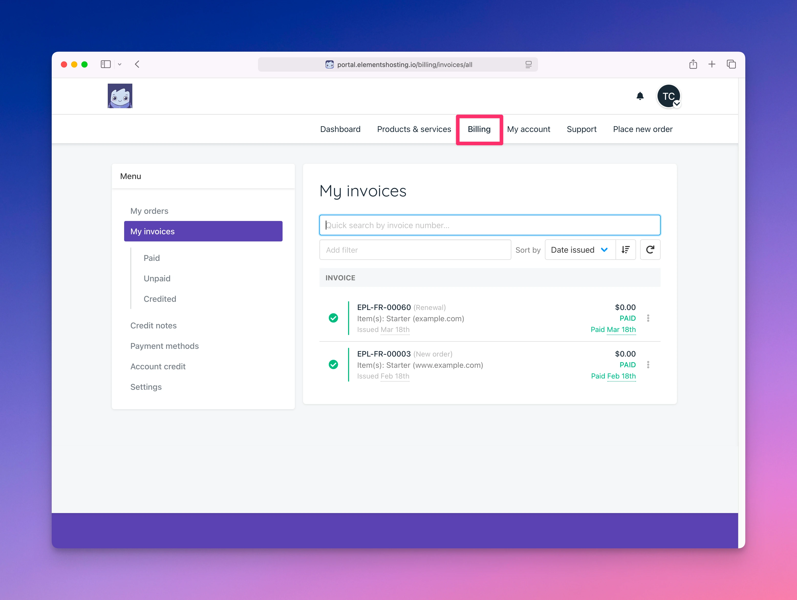

# Billing

<figure><figcaption></figcaption></figure>

The Billing page allows you to view and manage your Elements Hosting billing details.

From this page, you can:

* View your order history and place new orders
* View your invoice history, and download or print invoices
* View credit notes applied to your account
* View, add, remove, and update your payment methods
* View any account credit available on your account
* Update your preferred billing currency (USD, GBP, or EUR)
* Consolidate invoices if you have multiple products or services
