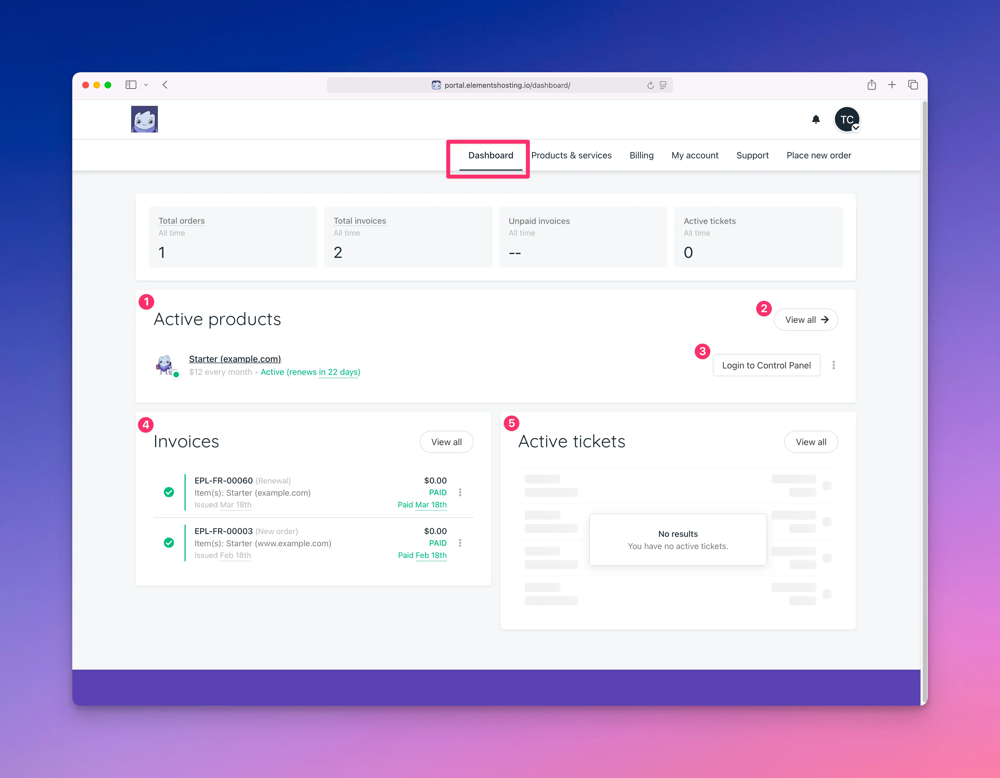

# Dashboard

<figure><figcaption></figcaption></figure>

Once logged into the [Elements Hosting Client Portal](https://portal.elementshosting.io/), you will land on the Dashboard.

From the Dashboard, you can:

1. View a short list of your active hosting products
2. Access a full list of your products if you have multiple services
3. Automatically log in to the Elements Hosting Reactor Panel to manage your websites
4. View or download your most recent invoices and see current payment status
5. View your most recent support tickets and their status
