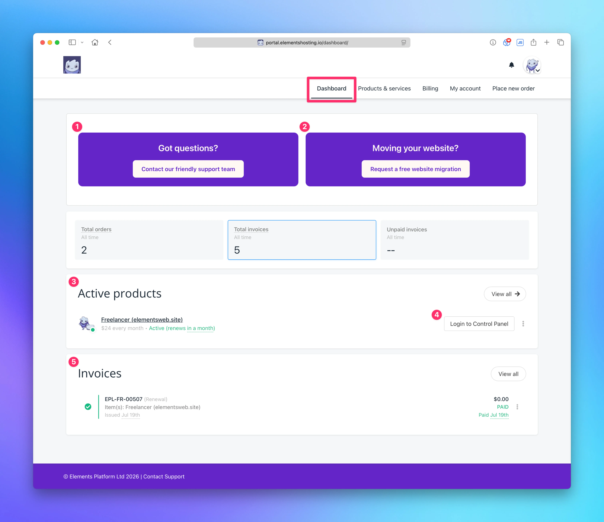

# Dashboard

<figure><figcaption></figcaption></figure>

Once logged into the [Elements Hosting Client Portal](https://portal.elementshosting.io/), you will land on the Dashboard.

From the Dashboard, you can:

1. Submit a support ticket to our friendly support team
2. Request a website migration
3. View a truncated list of your active products (web hosting accounts, domain name registrations. etc.) Click `View all` to view all active or inactive products and services.
4. Automatically log into the [Elements Hosting Reactor Panel](https://reactor.elementshosting.io/) to manage your websites
5. View or download your most recent invoices and see current payment status. Click `View all` to view your complete invoice history.
