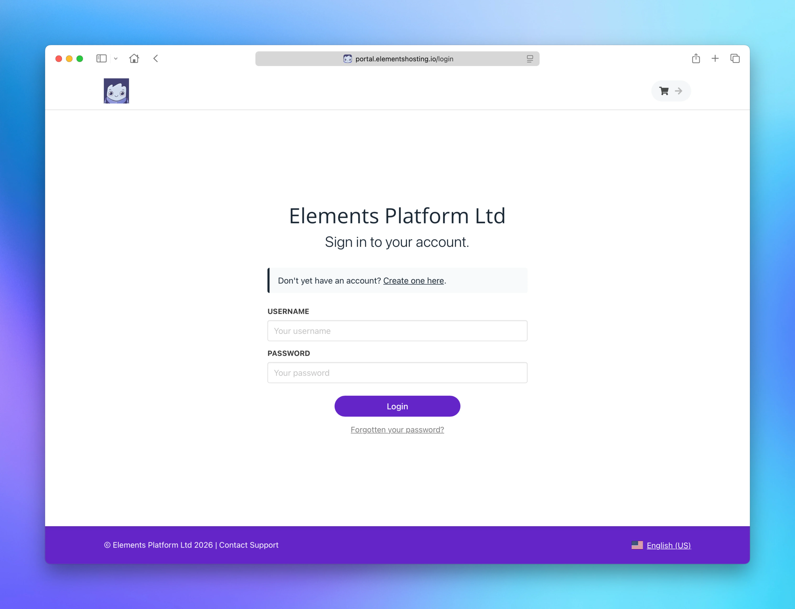

# Home

<figure><figcaption></figcaption></figure>

The [Elements Hosting Client Portal](https://portal.elementshosting.io/auth/login) is the central place where you manage your account, billing, and subscriptions.

From the Client Portal, you can:

* View and manage your hosting plans and subscriptions
* Update your billing details and payment methods
* View invoices and payment history
* Manage your account information and contact details
* Access your hosting services and related settings
* Submit support tickets for general, sales, billing, and technical support inquires.

To get started, log in to the [Elements Hosting Client Portal](https://portal.elementshosting.io/auth/login).

If you have forgotten your password, select **Forgotten your password?** below the Login button.
