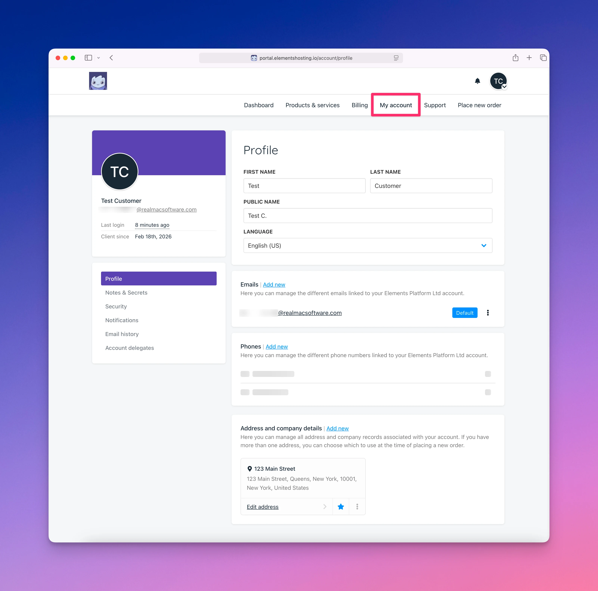

# My Account

<figure><figcaption></figcaption></figure>

The My Account page allows you to view and manage your Elements Hosting account details.

From this page, you can:

* Update your name, language, email address, phone number, and billing address
* Create and view notes for non-sensitive information and secrets for sensitive information that can be shared with the Elements Hosting team
* Enable 2FA (two-factor authentication), change your Client Portal password, and restrict access to your Client Portal by IP address
* Manage your notification settings
* View your Client Portal email history (system emails, support emails, etc.)
* Grant account access to other users, such as colleagues or clients
