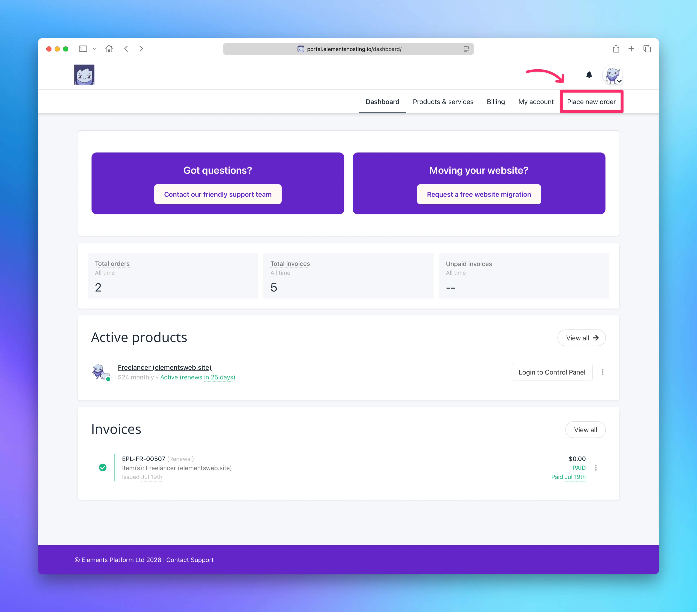
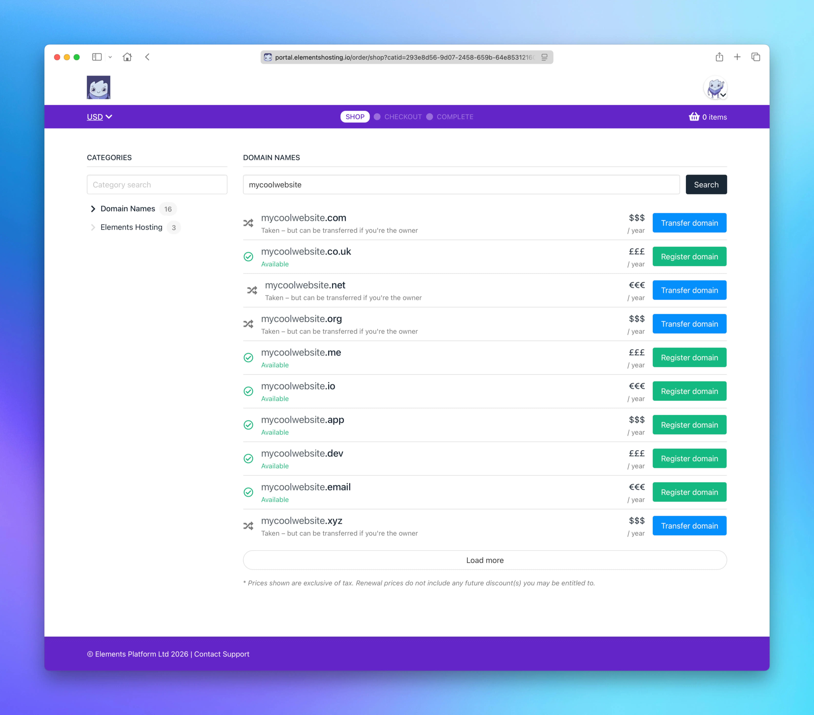
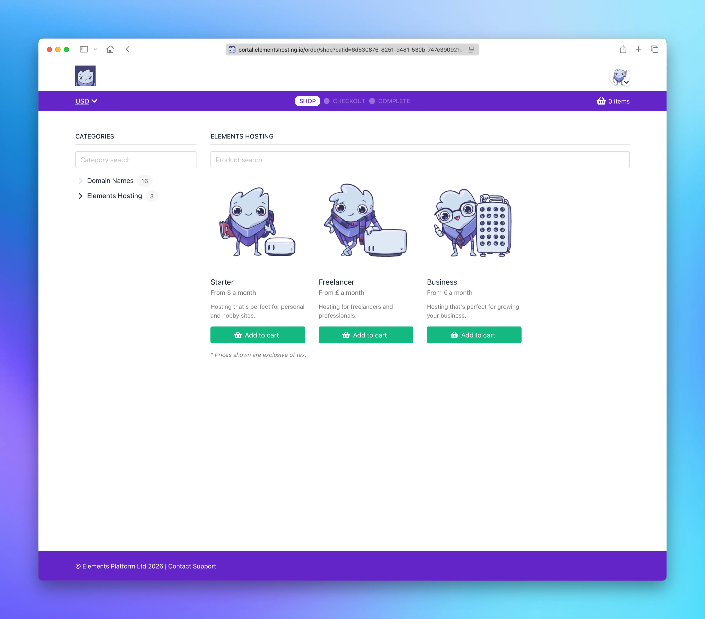

# Place New Order

<figure><figcaption></figcaption></figure> <figure><figcaption></figcaption></figure> <figure><figcaption></figcaption></figure>

The Place New Order page allows you to order new domain name registrations/transfers, as well as additional web hosting packages.

From this page, you can:

* Place an order for a new web hosting package (Starter, Freelancer, or Business package)
* Place an order for a new domain name registration or transfer

If you have any questions about any of our products or services, or need help placing your order, don't hesitate to [contact our friendly support team](mailto:support@elementsplatform.com)!
