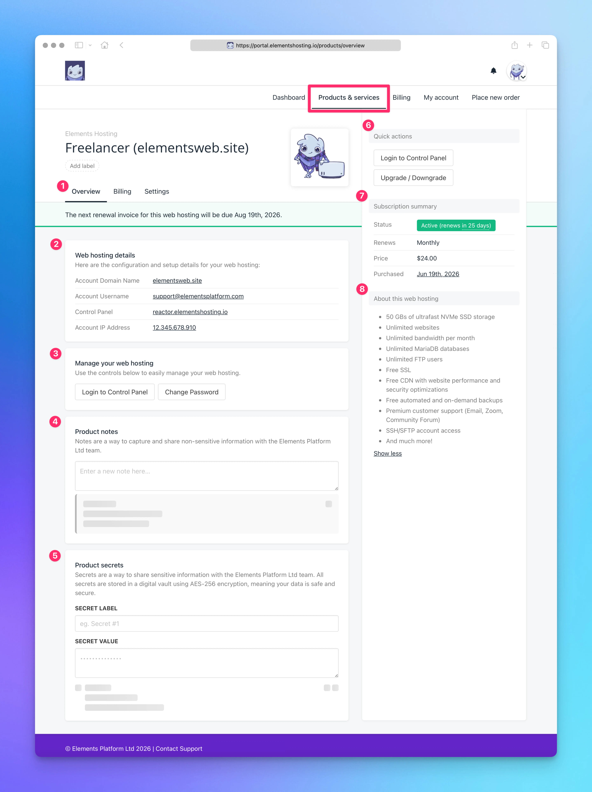

# Products & Services

<figure><figcaption></figcaption></figure>

The Products & Services page allows you to view and manage your individual hosting services.

From this page, you can:

1. View key details about your hosting service
2. Access your web hosting details and configuration information
3. Log into the Elements Hosting Reactor Panel to manage your website(s) or change your Reactor Panel password
4. Provide non-sensitive information to the Elements Hosting support team if needed
5. Securely share sensitive information, such as usernames and passwords, when requested by the Elements Hosting support team
6. Log into the Elements Hosting Reactor Panel or Upgrade/Downgrade your hosting service as your needs change
7. View your hosting subscription summary, including renewal date and status
8. View detailed information about your hosting package

