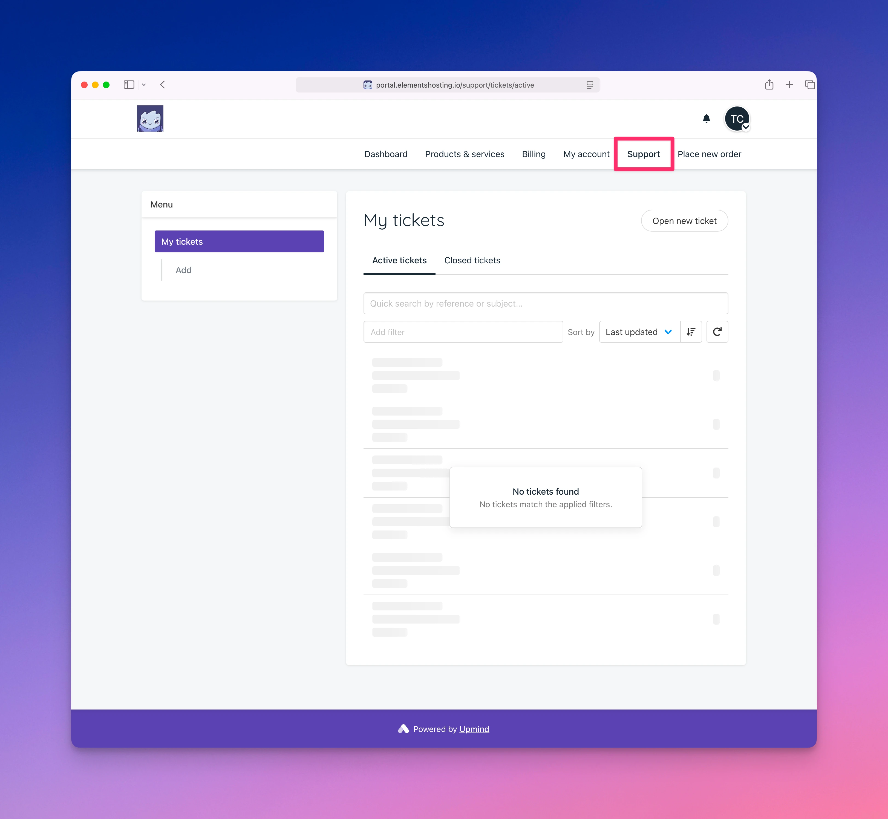

# Support

<figure><figcaption></figcaption></figure>

The Support page allows you to view and submit support tickets to the Elements Hosting support team.

From this page, you can:

* View your existing support tickets
* Open new support tickets
* Reply to existing support tickets
* Close resolved support tickets
