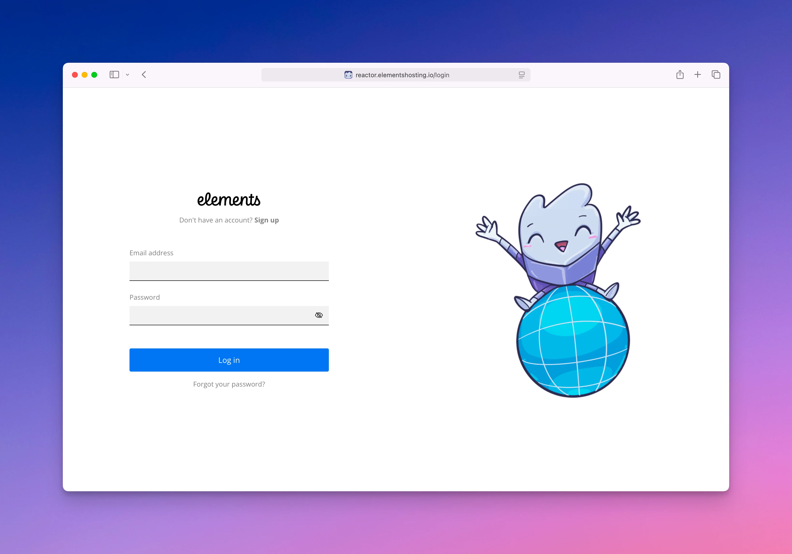

# Home

<figure><figcaption></figcaption></figure>

The [Elements Hosting Reactor Panel](https://reactor.elementshosting.io/) is the central place where you manage all aspects of your hosted websites.

From the Reactor Panel, you can:

* Manage websites, including creating new sites, and configuring addon domains, subdomains, and domain aliases
* Create and manage FTP users for file access
* Manage DNS records for your domains
* Upload, edit, delete, and view website files using the File Manager
* Create and manage MariaDB databases
* View, create, and restore website backups
* Issue and manage SSL certificates for your websites
* Set up and manage website redirects

To get started, log in to the [Elements Hosting Reactor Panel](https://reactor.elementshosting.io/).

If you have forgotten your password, select **Forgot your password?** below the Log in button.
