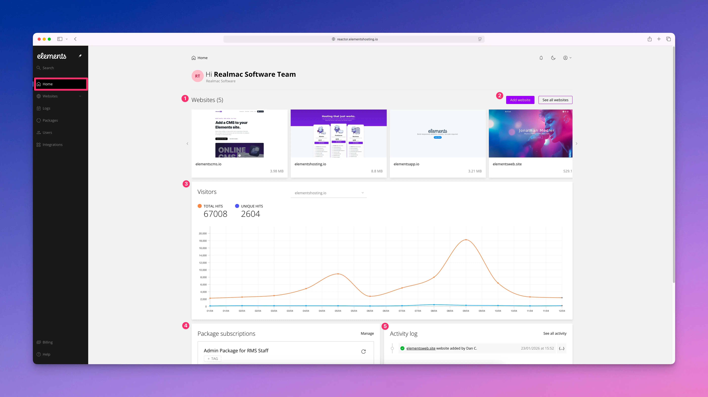

# Dashboard

<figure><figcaption></figcaption></figure>

Once logged into the [Elements Hosting Reactor Panel](https://reactor.elementshosting.io/), you will land on the Home dashboard.

From here you can:

1. View your websites
2. Add a new website (Freelancer & Business Plans only) or view all your existing websites in list format
3. View your website visitors analytics per website
4. See which hosting packages you are subscribed to
5. View the activity log for all users with access to your hosting account
