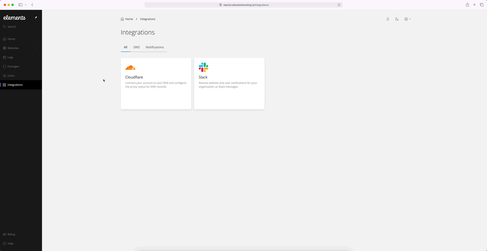
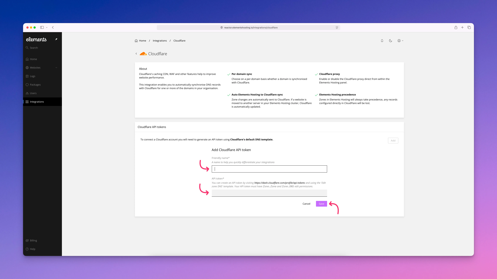

# DNS

Elements Hosting does not provide DNS hosting, allowing you to choose your preferred DNS provider to point your domain(s) to your Elements Hosting account.

We strongly recommend using Cloudflare as your DNS provider though, because the Elements Hosting Reactor Panel includes a built-in Cloudflare integration. This integration makes it easier to connect your domain to your hosting account while taking advantage of Cloudflare’s security and performance features, such as website optimization and protection against malicious activity.

In order to set up the Cloudflare DNS integration for your Elements Hosting account, follow the below steps:

#### Step 1

Log into the [Elements Hosting Reactor Panel](https://reactor.elementshosting.io/), click on `Integrations` in the sidebar menu, hover over the Cloudflare box, click the `Connect` button, then click the `Add` button.

<figure><figcaption></figcaption></figure>

#### Step 2

Enter the below:

* **Friendly Name** - A name to help you quickly differentiate your Cloudflare integrations if you have multiple domains/sites spanning multiple Cloudflare accounts.
* **API Token** - You can create an API token by visiting [https://dash.cloudflare.com/profile/api-tokens](https://dash.cloudflare.com/profile/api-tokens) and using the `Edit zone DNS` template. Your API token must have `Zone.Zone` and `Zone.DNS` edit permissions.

<figure><figcaption></figcaption></figure>
