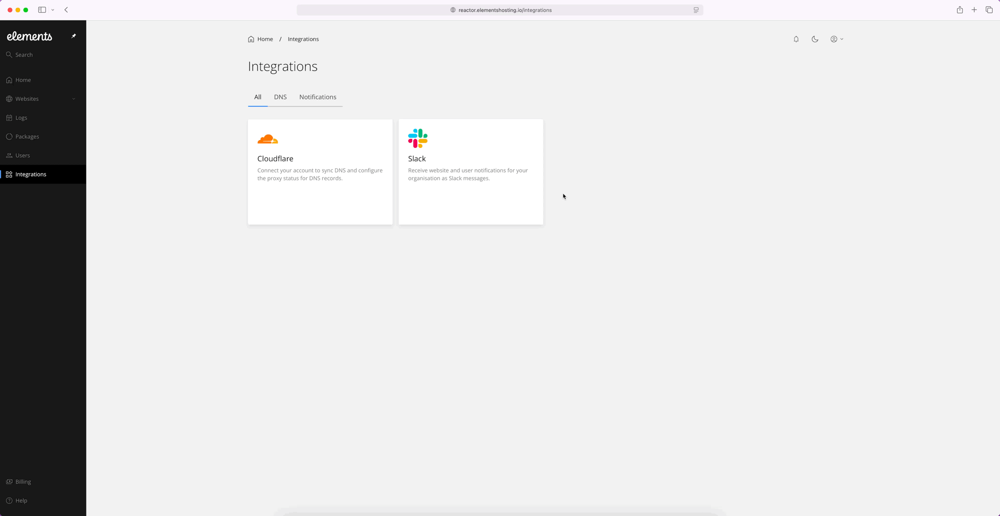
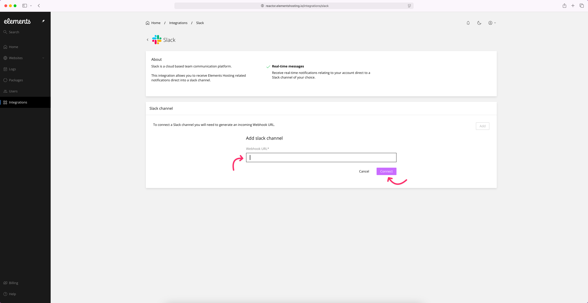

# Notifications

If you are a Slack user, Elements Hosting allows you to receive certain real-time account notifications directly in a Slack channel of your choosing!

To enable Slack notifications, follow the below steps.

#### Step 1

Log into the [Elements Hosting Reactor Panel](https://reactor.elementshosting.io/), click on `Integrations` in the sidebar menu, hover over the Slack box, click the `Connect` button, then click the `Add` button.

<figure><figcaption></figcaption></figure>

#### Step 2

Enter the Webhook URL for your Slack Channel and then click the `Connect` button.

<figure><figcaption></figcaption></figure>

#### Step 3

Check that your Slack integration is working by adding a new customer or website to your Elements Hosting account.
