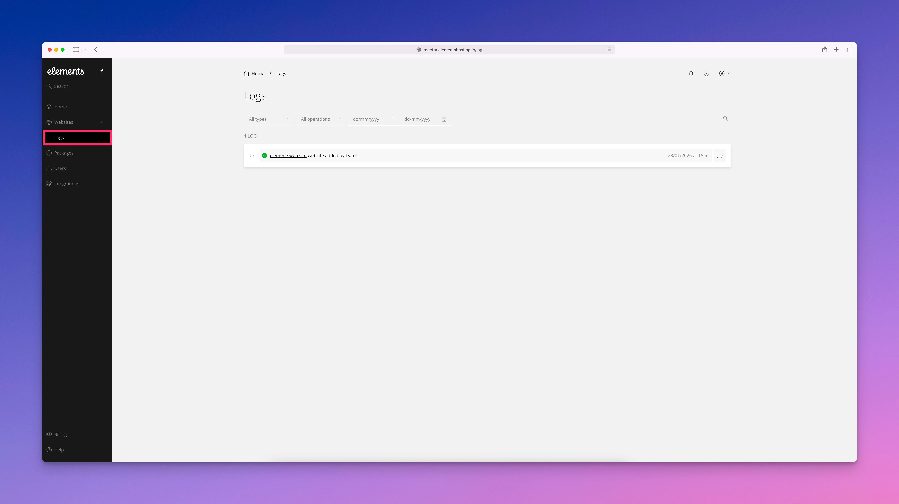

# Reactor Logs

<figure><figcaption></figcaption></figure>

The Logs section provides a record of actions and events that occur within the Elements Hosting Reactor Panel.

These logs help you track changes made to your hosting account, such as when a new domain or website is added. Reviewing logs can be useful for understanding recent account activity, confirming when changes were made, and identifying who performed specific actions. Logs are informational only and are intended to give visibility into configuration and management events within your Elements Hosting Reactor Panel.
