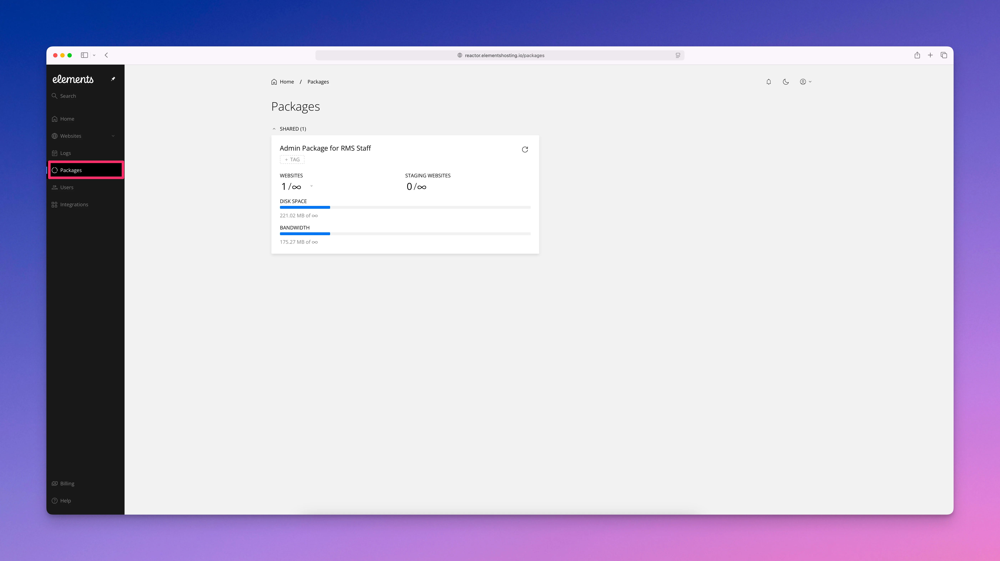

# Hosting Packages

<figure><figcaption></figcaption></figure>

Your hosting package defines the resources and features available to your website(s) on Elements Hosting. It determines things like how much storage, bandwidth, and other resources your site has access to. If you host multiple websites or have different needs, you can be subscribed to more than one hosting package at the same time.

Elements Hosting supports common package types, including shared and dedicated hosting. This makes it easy to match the right resources to each website while keeping everything organized and easy to manage in one place.
