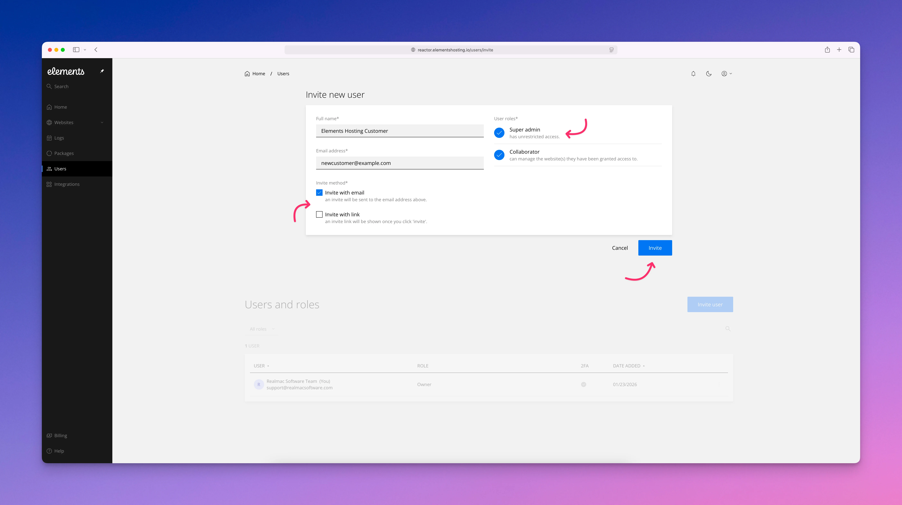
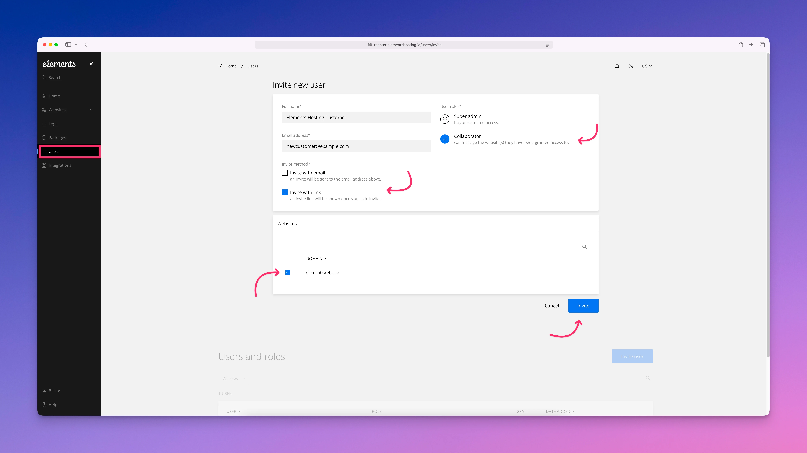
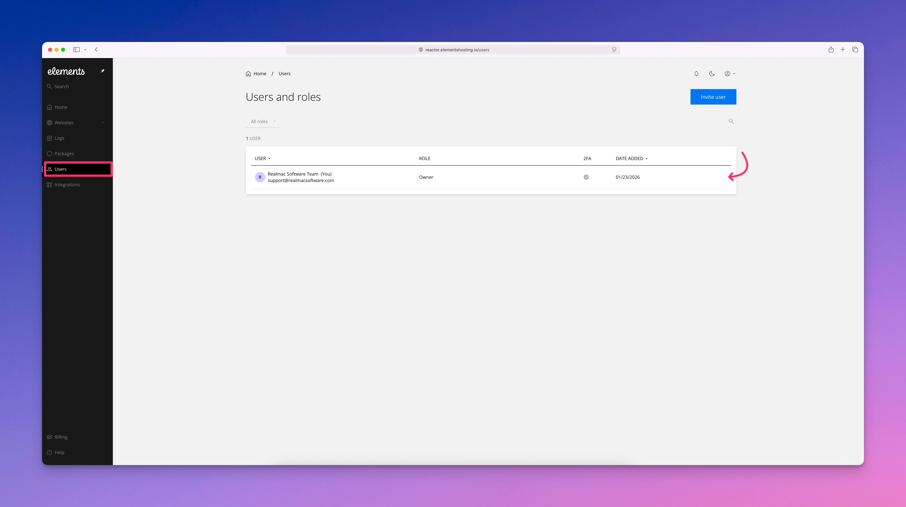

# Users and Roles

Elements Hosting lets you add new users to your hosting account with different levels of access. You can grant full account access to administrators or provide collaborators access to specific websites within your account. To add a new user, follow the steps below.

#### Step 1

Log into the [Elements Hosting Reactor Panel](https://reactor.elementshosting.io/websites), select `Users` from the sidebar menu, then click the blue `Invite user` button in the upper left corner.

<figure><figcaption></figcaption></figure>

#### Step 2

To add a new user as a Super admin, enter their full name and email address, select `Super admin`, select how you'd like to invite them (send them an email invitation automatically, or generate an invite link which you can send them via email or a messaging app manually), and finally click the blue `Invite` button.


Super admins will have full access to your entire Elements Hosting account. They will be able to access everything that you would be able to access. Grant this permission carefully, only to people you trust to have full access to your Elements Hosting account.


<figure><figcaption></figcaption></figure>

To add a new user as a Collaborator, enter their full name and email address, select `Collaborator`, select how you'd like to invite them (send them an email invitation automatically, or generate an invite link which you can send them via email or a messaging app manually), then under the `Websites` section select the websites you'd like to grant them access to, and finally click the blue `Invite` button.


Collaborators will only have access to the specific websites that you grant them access to. This user level permission is safer as it restricts their access to only the websites that you grant them access to. Collaborators do not have full account access, so we recommend assigning this role to new users when possible for greater account security.


<figure><figcaption></figcaption></figure>

You can manage your users from the `Users` page whenever needed by clicking the `...` icon next to the user you want to manage, then selecting the action you want to perform such as change their permission level (from Super admin to Collaborator or vice-versa), delete them from your Elements Hosting account, etc.).


In the user list, you can view each user’s name and email address, their assigned role and permissions, whether two-factor authentication (2FA) is enabled on their login account, and the date they were added to your hosting account.

We strongly recommend that all users enable 2FA on their login accounts. Two-factor authentication adds an extra layer of security, helping protect your Elements Hosting account from unauthorized access and reducing the risk of malicious activity or account compromise.


<figure><figcaption></figcaption></figure>
