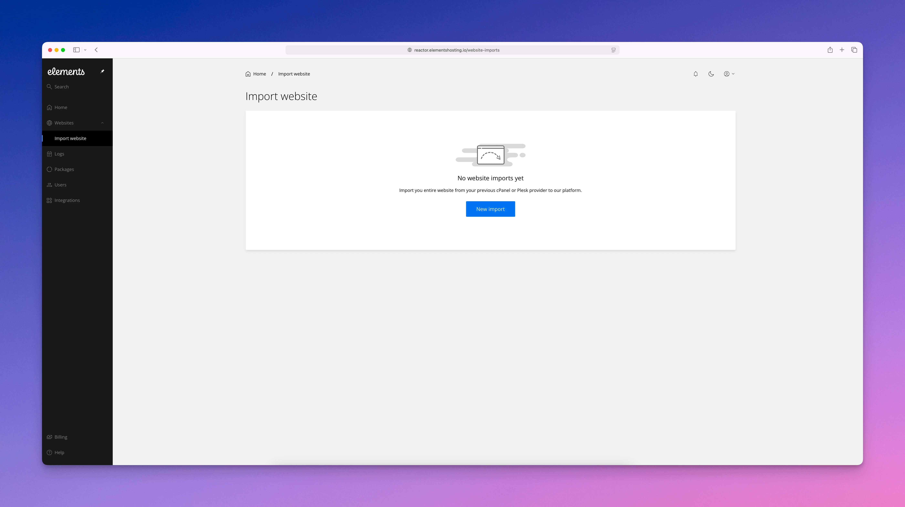

# Import Website

<figure><figcaption></figcaption></figure>

The Import Websites section lets you migrate an existing website from another hosting provider into Elements Hosting using the built-in importer. This tool supports websites managed through **cPanel** or **Plesk** control panels.


If your old web host is using a different control panel, please contact us to ask about or free website migration service.



[cpanel-imports.md](cpanel-imports.md)



[plesk-imports.md](plesk-imports.md)

