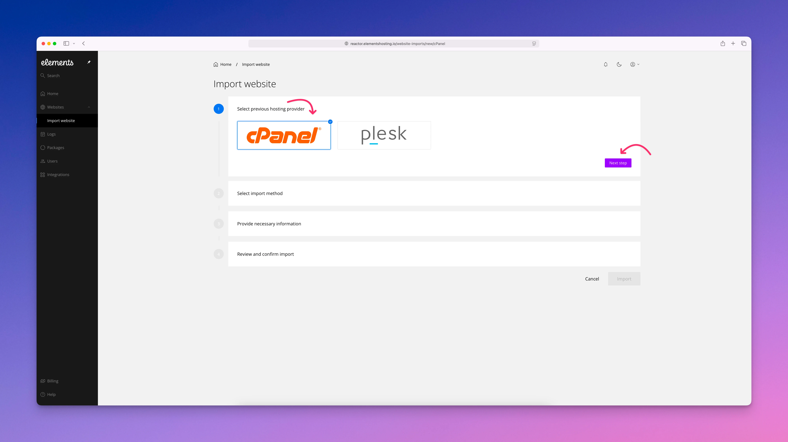
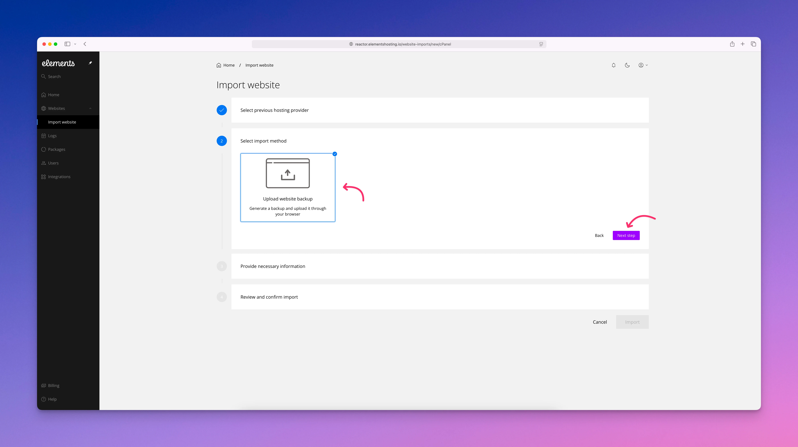
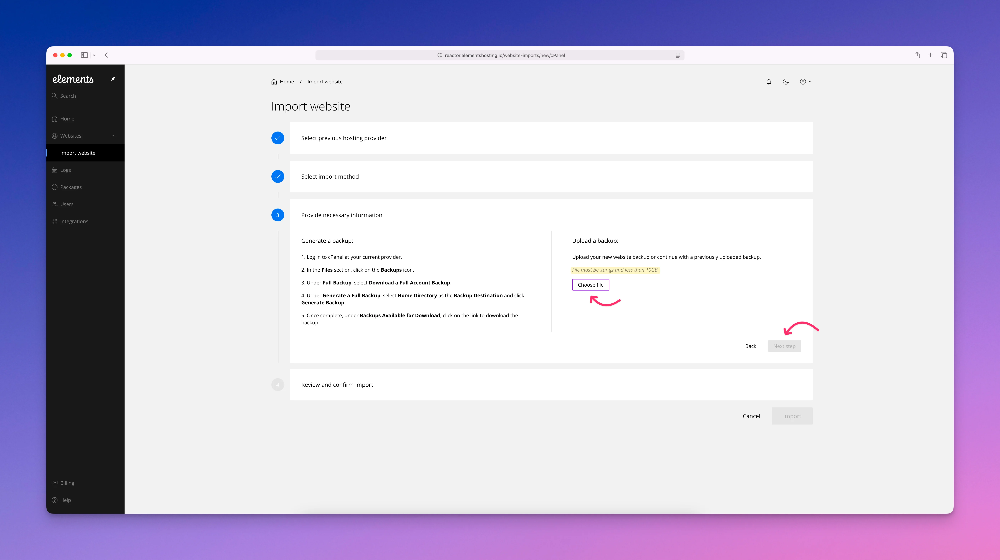

# cPanel Imports

### Import Websites from cPanel

For cPanel-based sites, Elements Hosting uses the cPanel importer to restore a full cPanel account backup into your hosting account.

When importing from cPanel, the importer restores the entire cPanel account as a single website in Elements Hosting. Your primary domain becomes the main website, while any subdomains, add-on domains, or parked domains are converted into mapped domains under that website. In most cases, websites will function the same after import as they did on cPanel. However, some cPanel-specific or proprietary features are not supported and will not be transferred.


If any domains you are importing already exist in your Elements Hosting account, you will need to delete these to proceed with the import.


#### What is Imported from cPanel

A cPanel import includes the following data and services:

* Primary website
* Subdomains, add-on domains, and parked domains mapped to a single website
* All website files
* All databases
* Installed applications
* Email accounts, including passwords and existing email data
* Forwarders-only email accounts
* Existing SSL certificates
* Cron jobs
* FTP accounts
* MX records and TXT records used for SPF

#### What Is Not Imported

Some cPanel-specific or proprietary features are not supported on Elements Hosting and will not be imported:

* PostgreSQL databases
* Wildcard subdomains
* Mailman settings
* Directory privacy settings
* Catch-all email addresses
* Autoresponders
* Calendars and contacts
* Existing website statistics
* Custom error pages

After the import completes, you should review your website and DNS settings to ensure everything is working as expected. Unsupported features may require manual reconfiguration using supported Elements Hosting workflows.

### How to import your cPanel based websites

#### Step 1

Expand `Websites` from the sidebar menu, click `Import website`, then click the `New import` button.

<figure><figcaption></figcaption></figure>

#### Step 2

Select `cPanel` then click the `Next step` button.

<figure><figcaption></figcaption></figure>

#### Step 3

Select `Upload website backup` then click the `Next step` button.

<figure><figcaption></figcaption></figure>

#### Step 4

Follow the instructions listed on the **Provide necessary information** page. Once your cPanel backup has been downloaded to your Mac, select `Choose file` and then select your cPanel backup file in order to upload it to your Elements Hosting account. Then click the `Next Step` button.


Your backup file **must be** in .tar.gz format, and less than 10GB. If your backup file is more than 10GB, please contact our support team to ask about our free website migration service.


<figure><figcaption></figcaption></figure>

#### Step 5

Review and confirm the import information, then start the import process. Please allow some time for your backup file to be restored to your Elements Hosting account. If you receive any errors or the backup process gets stuck, please contact us so we can help out.
