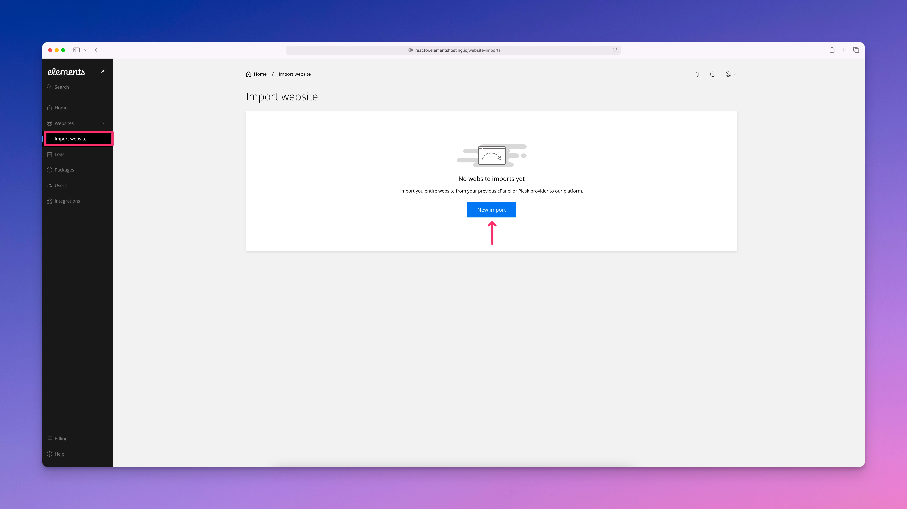
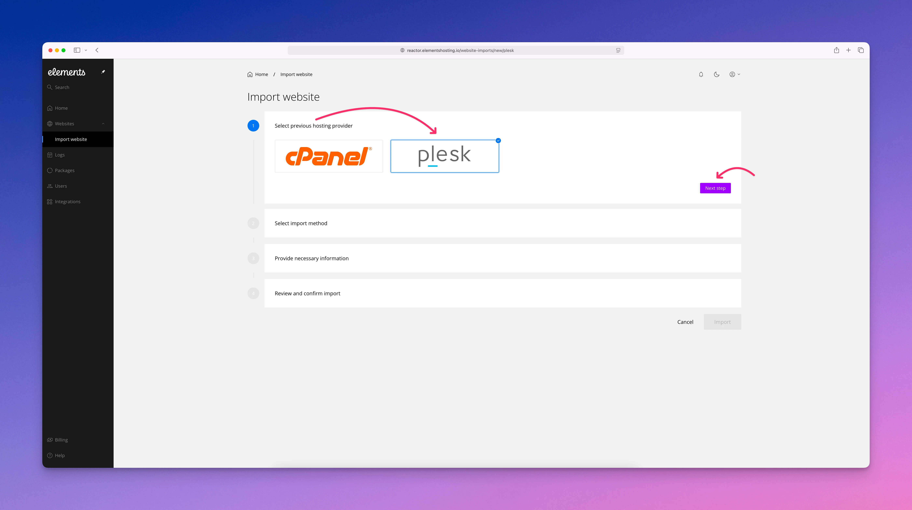
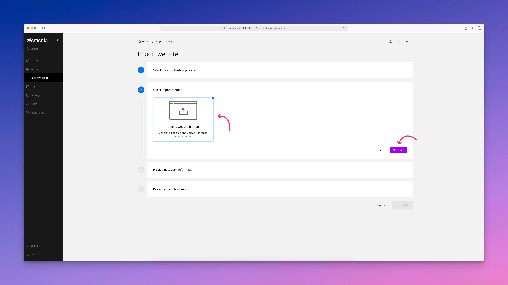
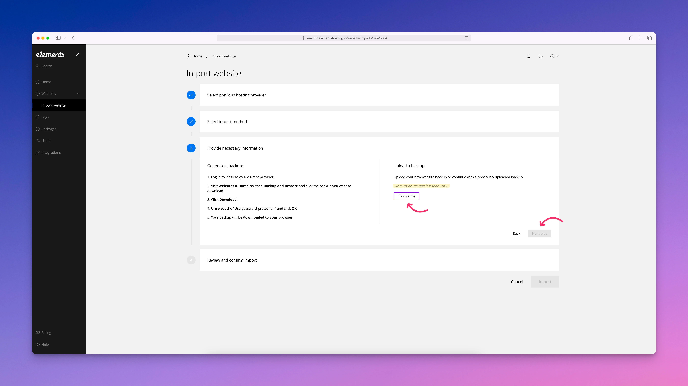

# Plesk Imports

### Import Websites from Plesk

The Plesk Import tool allows you to migrate an existing website from a Plesk hosting account into Elements Hosting. Please note that this tool is currently in BETA. While it has been thoroughly tested, you may encounter occasional issues or unexpected behavior. Any unusual behavior should be reported to us.

When importing from Plesk, the tool restores a full website backup. Your primary domain becomes the main website, while any subdomains or alias domains are converted into mapped domains under the same website. In most cases, websites should function the same after import as they did on Plesk. However, some proprietary or Plesk-specific features are not supported and will not be transferred.


If any domains you are importing already exist in your Elements Hosting account, you will need to delete these to proceed with the import.


#### What is Imported from Plesk

A Plesk import includes the following data and services:

* Primary website
* Subdomains and alias domains mapped to a single website
* All website files
* All databases
* Installed applications
* Email accounts, including passwords and existing email data
* Forwarders-only email accounts
* Existing SSL certificates
* Scheduled tasks (cron jobs)
* PHP version settings
* FTP accounts
* MX records and TXT records used for SPF

#### What Is Not Imported

Certain Plesk-specific or proprietary features are not supported on Elements Hosting and will not be imported:

* PostgreSQL databases
* Wildcard subdomains
* Mailman settings
* Directory privacy settings
* Catch-all email addresses
* Autoresponders
* Calendars and contacts
* Existing website statistics
* Custom error pages

After the import completes, review your website and DNS settings to ensure everything is functioning correctly. Unsupported features may need to be recreated manually using supported Elements Hosting tools and workflows.

### How to import your Plesk based websites

#### Step 1

Expand `Websites` from the sidebar menu, click `Import website`, then click the `New import` button.

<figure><figcaption></figcaption></figure>

#### Step 2

Select `plesk` then click the `Next step` button.

<figure><figcaption></figcaption></figure>

#### Step 3

Select `Upload website backup` then click the `Next step` button.

<figure><figcaption></figcaption></figure>

#### Step 4

Follow the instructions listed on the **Provide necessary information** page. Once your Plesk backup has been downloaded to your Mac, select `Choose file` and then select your Plesk backup file in order to upload it to your Elements Hosting account. Then click the `Next Step` button.


Your backup file **must be** in .tar format, and less than 10GB. If your backup file is more than 10GB, please contact our support team to ask about our free website migration service.


<figure><figcaption></figcaption></figure>

#### Step 5

Review and confirm the import information, then start the import process. Please allow some time for your backup file to be restored to your Elements Hosting account. If you receive any errors or the backup process gets stuck, please contact us so we can help out.
