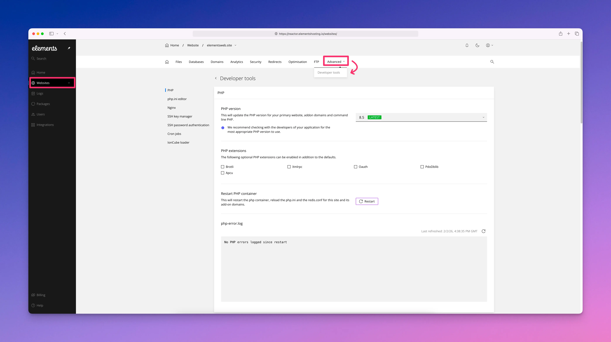
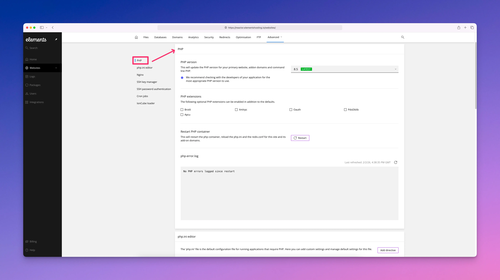
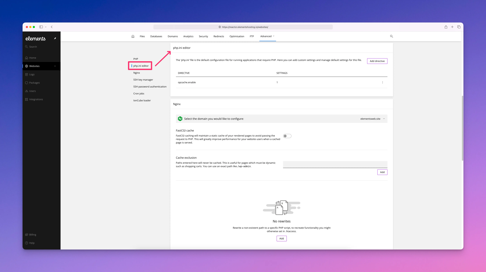
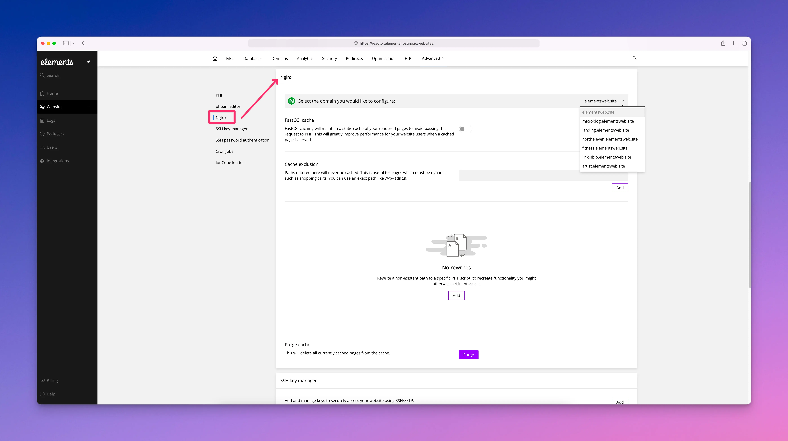
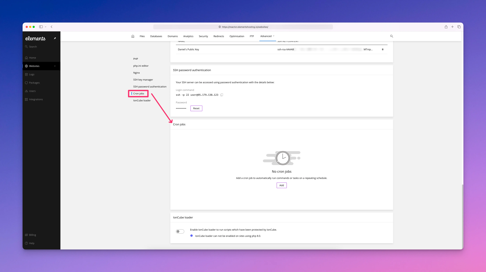

# Developer Tools

Elements Hosting comes with advanced tools and settings to manage your website(s). You can locate them by clicking on `Websites` in the sidebar menu, selecting the site you want to manage, clicking `Advanced` in the top menu, then selecting `Developer tools` from the drop-down menu.


These tools and settings should be used with caution, only change/modify them if you know what you are doing. If in doubt, contact us before making any changes/modifications in this section so we can properly guide you.


<figure><figcaption></figcaption></figure>

### PHP

<figure><figcaption></figcaption></figure>

#### PHP version

Select or change the PHP version for your primary website and addon domains from the drop down menu. We offer PHP versions 8.2, 8.3, 8.4, and 8.5.


PHP 8.4 is set as the default for all our hosting accounts.


#### PHP extensions

Select optional PHP extensions to enable for your primary website and addon domains. Leave these **unchecked** unless you know you need a specific PHP module listed here to be enabled.

#### Restart PHP container

Each primary website on your Elements Hosting account has its own PHP container. It is possible to restart this container without impacting other websites on your account.

Restarting a website's PHP container will reload the php.ini and the redis.conf for this site and its addon, aliases and subdomains domains. It will also terminate any stuck PHP workers and allow for new requests to be served.

#### php-error.log

The PHP error log shows problems that occur while your website is running. It may include critical errors, code issues, warnings, or messages about outdated features. This log also contains technical details used to diagnose problems. 

Error logs are for troubleshooting and are not visible to your site visitors.

### php.ini editor

<figure><figcaption></figcaption></figure>

A php.ini file controls how PHP behaves on the server. It does not change your website’s code directly, but it defines limits, defaults, and features that affect how PHP processes requests and handles resources.

Common types of settings you can modify include resource limits, such as the maximum memory a PHP script can use, how long a script is allowed to run, and how large uploaded files can be. These settings are often adjusted to support larger contact form submissions, image uploads, or more complex PHP processing.

You can also control error handling and logging behavior, including whether errors are displayed on the site or written to log files. Other configurable areas include session behavior, time zones, character encoding, and the enabling or disabling of specific PHP extensions. On Elements Hosting, any available php.ini settings apply to PHP features supported by RapidWeaver-generated sites, and changes should be made carefully, as incorrect values can affect site functionality or performance.

### Nginx

<figure><figcaption></figcaption></figure>

#### FastCGI cache

FastCGI caching is one of the primary ways Elements Hosting improves performance for PHP-enabled RapidWeaver sites. Instead of running PHP for every single page request, NGINX stores the finished output of a page in memory or on disk and reuses it for future visitors. This dramatically reduces processing time and server load, especially on pages that show the same content to everyone.

For Elements-hosted sites, this means faster page loads, more consistent performance during traffic spikes, and less strain on PHP resources. When a page is cached, NGINX can serve it immediately without waiting for PHP to run, which is often the slowest part of handling a request.

#### Cache exclusion

Not every page should be cached. Some requests must always be handled dynamically to function correctly. Cache exclusion allows Elements Hosting to skip FastCGI caching for specific URLs or request types so those pages are always generated fresh by PHP.

This is important for RapidWeaver features like contact forms, confirmation pages, or any page that responds to user input. By excluding only the necessary pages from caching, Elements Hosting preserves correct behavior while still allowing the rest of the site to benefit from FastCGI cache performance improvements.

#### Nginx rewrites

NGINX rewrites control how incoming requests are handled before any page is served. On Elements Hosting, rewrites are commonly used to enforce a preferred domain, redirect visitors to HTTPS, or ensure clean, consistent URLs for RapidWeaver sites.

Because rewrites are processed directly by NGINX, they happen extremely quickly and do not involve PHP. This makes redirects and URL handling more efficient while also helping search engines and visitors reach the correct version of your site without unnecessary processing.

#### Purge cache

Purging the cache tells NGINX to discard stored FastCGI cached pages and generate fresh versions. This is useful after publishing updates from RapidWeaver, changing site behavior, or troubleshooting issues where old content is still being served.

On Elements Hosting, purging the cache does not affect your site files or settings. It simply forces NGINX to rebuild the cache as new requests come in, ensuring visitors see the latest version of your site while continuing to benefit from high-performance caching once the cache is regenerated.

### SSH key manager

<figure><figcaption></figcaption></figure>

The SSH key manager is where you can add a public SSH key so you can log in to your Elements Hosting account without using a password. You can also use SSH key authentication in the RapidWeaver Element's publishing settings, allowing you to publish your website via SFTP without having to enter a password.

Using an SSH key makes publishing and file transfers from RapidWeaver Elements more secure and easier to manage, because the Elements app can connect without asking for your account password.

From here you can see any public key already attached to the account, and delete the public key if you need to replace i&#x74;**.** Removing the public key from the panel immediately stops key-based access for that account.&#x20;

For more technical users, after you add your public key, the panel shows the exact connection command you can copy and use in a terminal or an SFTP client if you prefer to connect that way. If you do not yet have an SSH key, you can generate one on your Mac. If you are unsure how to do this, check out our guide here on how to generate an SSH key on your Mac.


When generating an SSH key pair, you will receive both a private and public key. **Never share your SSH private key with anyone!** The private key stays on your computer and must be kept secret.

In the Elements Hosting Reactor Panel, you should **only add your public key**. The private key should not be added.


### SSH (SFTP) password authentication

<figure><figcaption></figcaption></figure>

This section is useful when you want to publish your RapidWeaver Elements site over SFTP, which is more secure than FTP.

From here you can view your SFTP username and the server IP address. You can also reset your SSH/SFTP password if you have forgotten it. To reset your SSH/SFTP password click `Reset` and follow the on-screen steps to choose a new password, which you can enter in RapidWeaver Element's publishing settings in order to securely connect to your Elements Hosting account and publish your website.

Additionally, the SSH password authentication section shows the exact command you can paste into the Terminal app on your Mac to connect to your hosting account. This should only be used by advanced users who are comfortable working via command line interface in their Terminal app.


Note: Resetting the password does not remove or change any SSH keys you have added in the SSH key manager; if you use key-based login, that will continue to work independently.&#x20;

Make sure you store your SSH/SFTP password securely, preferably in a password manager.


### Cron jobs

<figure><figcaption></figcaption></figure>

Cron jobs allow you to schedule commands or tasks to run automatically on a repeating schedule, without any manual intervention. On Elements Hosting, cron jobs run on the server and are commonly used to handle background tasks that need to occur at regular intervals, such as cleanup routines or automated processes related to your site.

For Elements Hosting users, cron jobs are most often used alongside PHP-based features included with RapidWeaver projects, such as scheduled form processing, periodic data handling, or triggering scripts that support site functionality. Running these tasks on a schedule helps keep your site operating smoothly without requiring you to perform repetitive actions yourself.

By using cron jobs, you can automate routine maintenance and supporting tasks while keeping them separate from normal page requests. This improves reliability and ensures that time-based or recurring actions happen consistently, even when no one is actively visiting your site.

### IonCube loader

<figure><figcaption></figcaption></figure>

The ionCube Loader is a PHP extension that allows the server to run PHP files that have been encoded using ionCube. Encoding is typically used by third-party or commercial PHP applications to protect their source code from being viewed or modified, while still allowing the application to function normally.

Most Elements Hosting customers will never need to enable the ionCube Loader. RapidWeaver Elements sites do not rely on encoded PHP files, and standard site features work without it. Unless a specific third-party PHP script explicitly requires ionCube, this setting can safely remain disabled.
