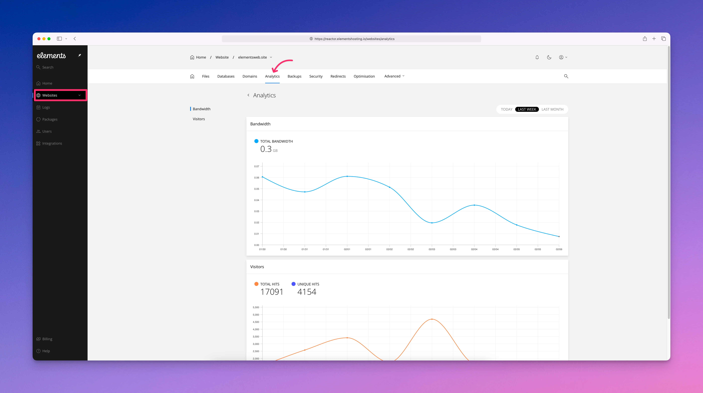

# Analytics

<figure><figcaption></figcaption></figure>

The Analytics section provides a simple, high-level view of activity for your website. It displays total bandwidth usage along with basic visitor statistics, including total hits and unique hits. These statistics apply to your primary website and include any addon domains, subdomains, or domain aliases hosted under that site.

This section is intended for quick reference rather than detailed analysis. For deeper insights into visitor behavior, traffic sources, and page-level performance, Elements Hosting recommends using a dedicated third-party analytics service. Popular options include free tools like Google Analytics, as well as paid services such as [Plausible](https://plausible.io/) or [GoSquared](https://www.gosquared.com/), which can be integrated directly into your RapidWeaver Elements site.
