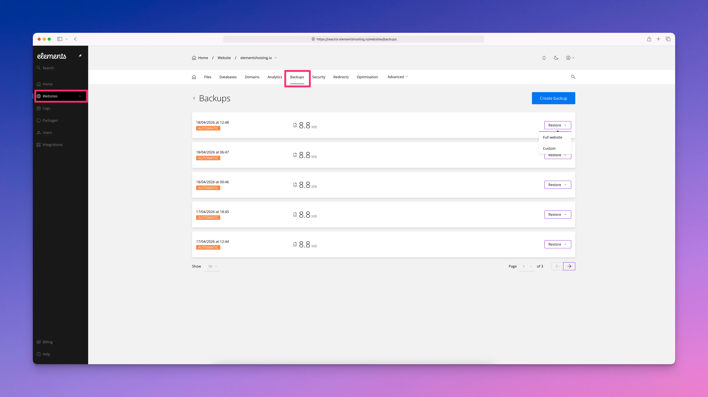
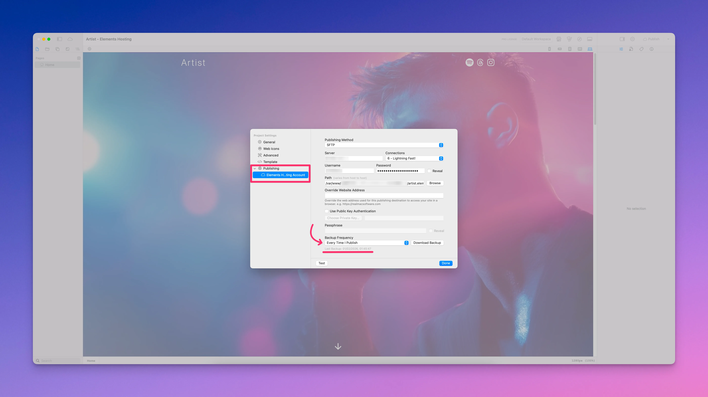
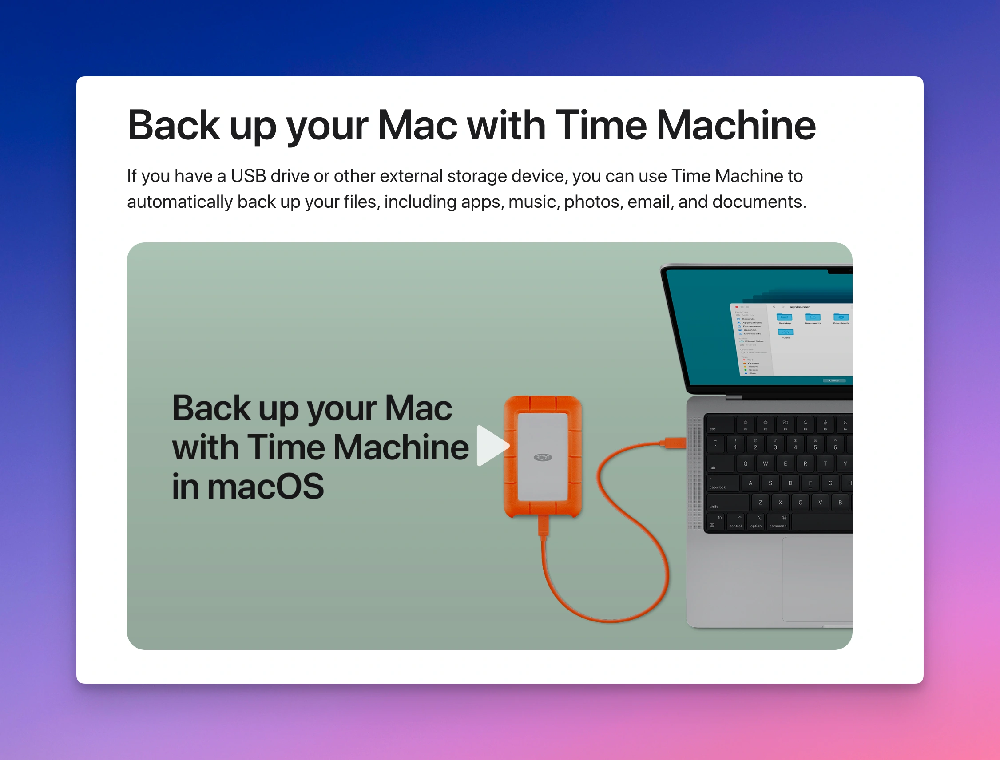
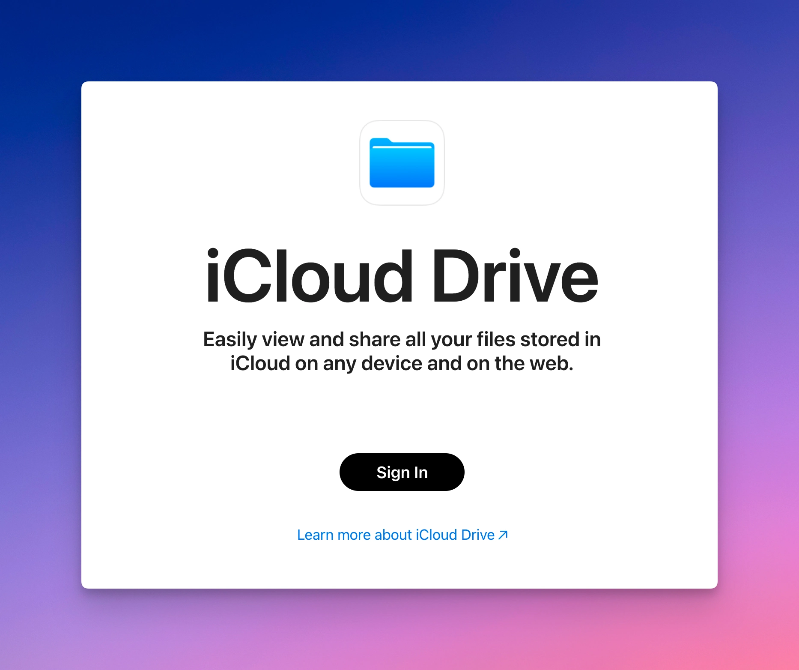

# Backups

Elements Hosting provides built-in backup systems to help protect your websites and account data. These backups are designed to support recovery in the event of data loss or unexpected issues. However, server-side backups alone should not be your only form of protection.

To reduce the risk of data loss, Elements Hosting recommends maintaining multiple backup layers, including local and project-level backups you control.&#x20;

The sections below explain the backup options available on Elements Hosting, how they work, and which additional backup practices are recommended for your RapidWeaver Elements projects.

#### Elements Hosting Backups

<figure><figcaption></figcaption></figure>

The Elements Hosting Backups service is designed to give you a reliable way to protect your websites and hosting account data, while also making backups and restores faster and easier to manage.

Automatic backups are performed every **6 hours** and retained for **30 days**. This gives you a large restore history, making it easier to recover from accidental changes, deleted files, website problems, or other unexpected issues.

Backups include your websites, files, databases, and other hosting account data. All backups are stored securely on dedicated backup infrastructure located in Nuremberg, Germany, providing **full EU data residency and GDPR compliance**.

Elements Hosting uses incremental backups, which means only the files and folders that have changed since the previous backup are stored. This makes backups more efficient, improves reliability, and allows backups and restores to complete faster.

You can restore individual files or folders if you only need to recover specific content, or you can restore an entire website or full hosting account if needed. You can also restore websites that were permanently deleted, provided they are still within the 30-day backup retention period.

All backups and restores can be managed directly from the [Elements Hosting Reactor Panel](https://reactor.elementshosting.io/). In addition to the automatic backups created by Elements Hosting, you can also create manual backups on demand whenever you want extra protection before making changes to your website.

#### Project File Backups Published to Elements Hosting

<figure><figcaption></figcaption></figure>

RapidWeaver Elements includes an additional layer of protection through its publishing settings. Each time you publish your site, the app can automatically back up your project file and upload it to your Elements Hosting account. This backup is stored on your hosting account and can be restored directly from within the Elements app under Publishing settings.

Elements Hosting strongly recommends leaving this option enabled and set to **Every Time I Publish**. This ensures you always have a current copy of your project file stored on your hosting account alongside your website.

***


In addition to the above two backup methods which Elements Hosting handles, we also recommend that our customers follow the below two backup recommendations for extra protection and backup redundancy.


#### Local Project File Backups (Time Machine)

<figure><figcaption></figcaption></figure>

In addition to server-side backups, Elements Hosting strongly recommends that you maintain local backups of your RapidWeaver Elements project files. Your project file is the source of your website and cannot be recreated from published site files alone.

Enabling [Time Machine backups](https://support.apple.com/en-us/104984) on your Mac ensures your project files are continuously backed up to an external drive. This provides a reliable local recovery option if a project file is accidentally deleted, overwritten, or becomes corrupted.

#### Project Files Stored in iCloud Drive

<figure><figcaption></figcaption></figure>

Storing your Elements project files in [iCloud Drive](https://support.apple.com/en-us/118443) provides an additional layer of protection and convenience. When a project file is saved in iCloud Drive, it is automatically synced across your Apple devices and stored off your local machine. This helps protect against data loss if your Mac is damaged, lost, or experiences a hardware failure.

[iCloud Drive](https://support.apple.com/en-us/118443) works well alongside Time Machine. While Time Machine provides versioned local backups to an external drive, iCloud Drive ensures your project files are continuously copied to cloud storage and are easily accessible from other devices. For best results, Elements Hosting recommends using iCloud Drive in combination with local Time Machine backups.


Elements Hosting **does not recommend** storing your project file(s) on any other third-party cloud storage provider, such as Dropbox, OneDrive, Google Drive, or a local NAS (Network Attached Storage) setup.

We have seen countless project files become corrupted and suffer data loss when being stored on these above systems/services.

If you decide to store your project file(s) on any of these other third-party storage solutions, we are not able to help you in the event your project file(s) become corrupted or damaged.

