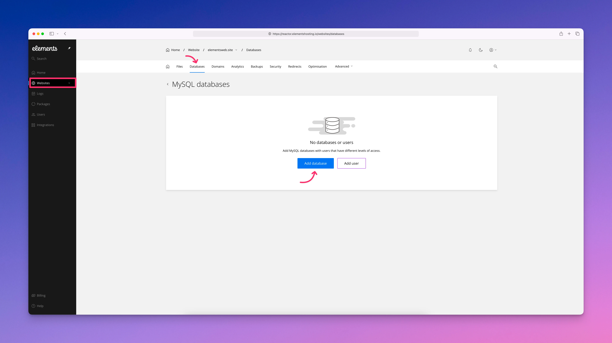
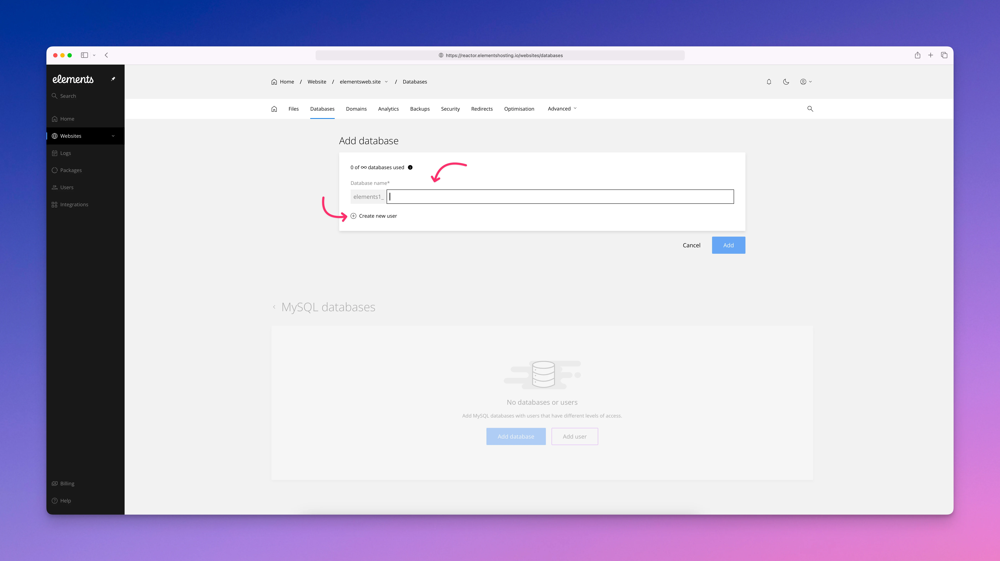
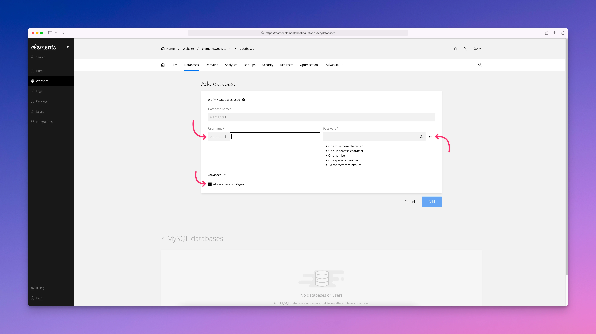
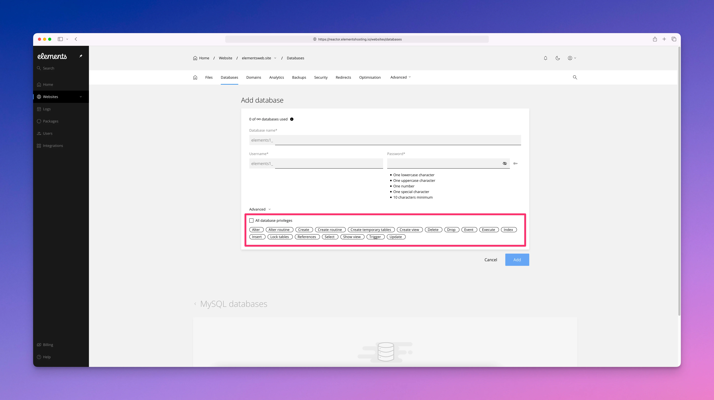
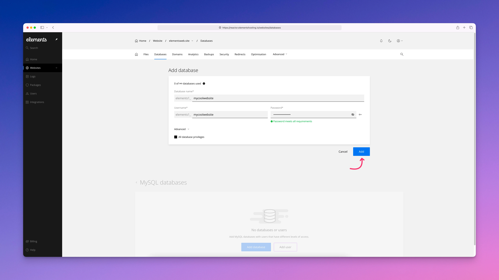

# Databases

The Databases section lets you create and manage databases used by your websites on Elements Hosting. Elements Hosting uses **MariaDB 11.4.9**, a modern, high-performance database server that is compatible with MySQL.

From the Elements Hosting Reactor Panel, you can create, edit, and delete databases, as well as manage database users and their permissions. For direct access to your database data, Elements Hosting also provides phpMyAdmin, which allows you to log in through your browser to view tables, run queries, and perform database maintenance tasks when needed.

To create a new database and database user, follow the below steps:

#### Step 1

Log into the [Elements Hosting Reactor Panel](https://reactor.elementshosting.io/login) and click on `Websites` in the sidebar, click on the website you'd like to create a database for, click on `Databases` in the top menu, then click on the `Add database` button.

<figure><figcaption></figcaption></figure>

#### Step 2

Enter a unique name for your database. Make sure the database name only includes letters and numbers. **Do not use special characters or spaces** in your database name.

Next, click on the `+` icon to create a new database user for the database.

<figure><figcaption></figcaption></figure>

#### Step 3

Enter a unique name for your database user. Make sure the database user name only includes letters and numbers. **Do not use special characters or spaces** in your database user name.

Next, enter a database user password. You can click on the key icon to automatically generate a password for you (**recommended**).

Finally, the checkbox `All database privileges` is checked by default. If you want to limit the privileges for the database user, you can uncheck the box, then select the specific privileges you want to grant for the database user.


Granting insufficient database user privileges can interfere with the functionality of your database. If you opt to limit your database user privileges, make sure you understand what you're doing and what privileges your database user needs for your database to function properly. When in doubt, contact us if you have any questions.


<figure><figcaption></figcaption></figure>

<figure><figcaption></figcaption></figure>

#### Step 4

Once you've got your database name, database username and password, and the database user privileges entered, click on the `Add` button.

<figure><figcaption></figcaption></figure>


Congrats, your database should now be successfully set up and ready to go!

