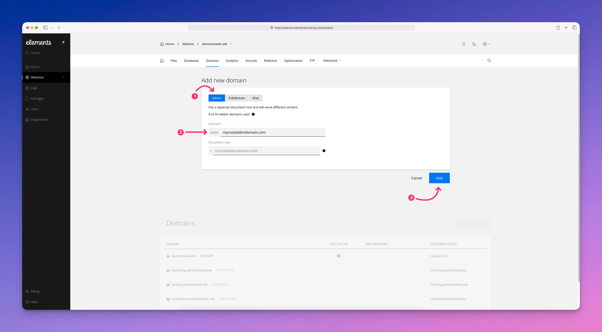
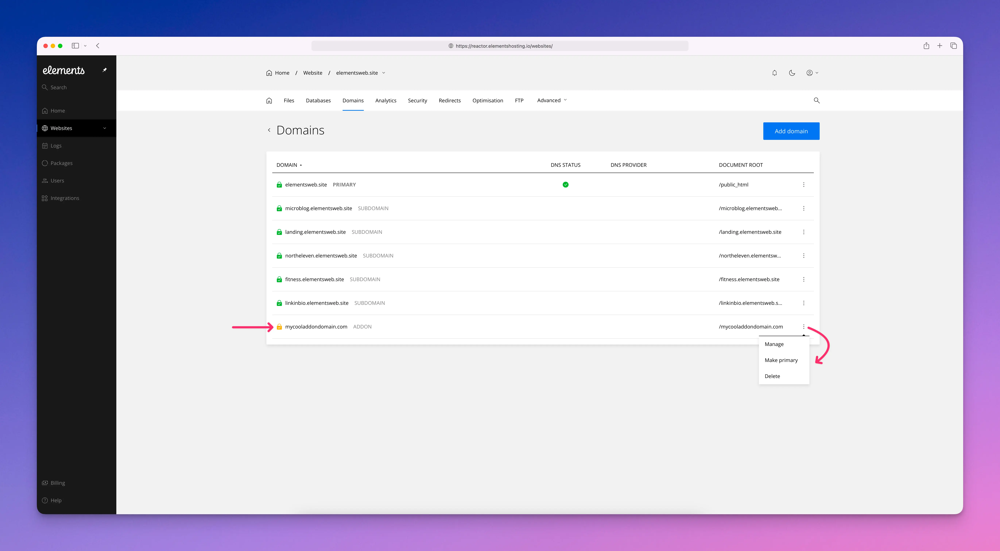

# Addon Domains

An **addon domain** is an extra website you can add to your existing Elements Hosting account. It’s a great way to host more than one website without buying another hosting plan.

When you add an addon domain using the Elements Hosting Reactor Panel, it gets its own folder to store website files. This lets it work like a completely separate website, even though it shares the same hosting space as your main site.

To add an addon domain to your Elements Hosting account, follow the steps below.

#### Step 1

Log into the [Elements Hosting Reactor Panel](https://reactor.elementshosting.io/login) and click on `Websites` in the sidebar, then click on the website you'd like to add an addon domain under.

<figure><figcaption></figcaption></figure>

#### Step 2

Click on `Domains` in the top menu, then click on the blue `Add domain` button.

<figure><figcaption></figcaption></figure>

#### Step 3

Select `Addon`, then in the `Domain*` field enter your desired addon domain name. The `Document root` field will be auto-filled as you type your addon domain name. We recommend leaving this as-is as this is the folder where your addon domain's website files should be uploaded to.&#x20;

When finished click the blue `Add` button.

<figure><figcaption></figcaption></figure>

#### Step 4

You will now see your addon domain listed in your Domains list.&#x20;

Click on `...` in order to:

* Manage your addon domain's document root folder, DNS records, and enable/disable DNSSEC
* Make your addon domain the primary website on your Elements Hosting account
* Delete your addon domain if needed


If your addon domain's DNS is not yet pointed to your Elements Hosting account's IP address, you will see a yellow padlock next to it indicating a Let's Encrypt SSL certificate has not yet been issued for it.

Once you point the DNS for your addon domain to your Elements Hosting account's IP address, a new Let's Encrypt SSL certificate will be auto-provisioned and you will then see a green padlock next to it in the list, indicating your website is SSL secured!


<figure><figcaption></figcaption></figure>
