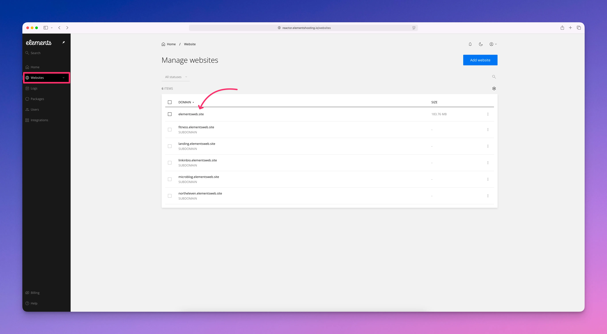
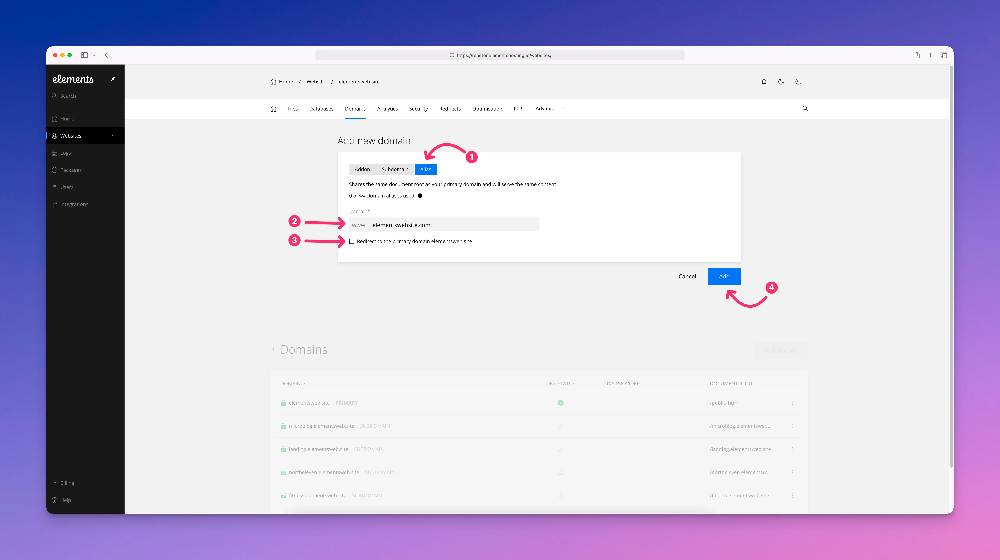
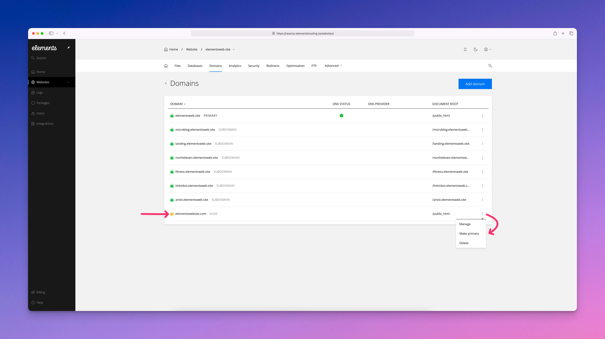

# Domain aliases

A domain alias is an additional domain name that points to the same website as your primary domain. On Elements Hosting, a domain alias shares the same document root as the primary domain, which means both domains load the same site files and display the same content. This lets you use more than one domain name without having to manage multiple websites.

When you add a domain alias, you can decide how it behaves for visitors. The alias can load the site just like the primary domain, or it can automatically redirect visitors to the primary domain instead. Redirecting is often used to keep a single main domain for search engines and visitors, while still capturing traffic from alternate domain names.

Domain aliases are commonly used for domain variations, such as domains with different domain extensions (.com, .net, .org, etc.), or alternate brand domains that should lead to the same site. Below we'll walk through how to add a domain alias to your Elements Hosting account.

#### Step 1

Log into the [Elements Hosting Reactor Panel](https://reactor.elementshosting.io/login) and click on `Websites` in the sidebar, then click on the website you'd like to add a domain alias to.

<figure><figcaption></figcaption></figure>

#### Step 2

Click on `Domains` in the top menu, then click on the blue `Add domain` button.

<figure><figcaption></figcaption></figure>

#### Step 3

Select `Alias`, then in the `Domain*` field enter your desired domain alias.

You can select to have your domain alias load the content of your primary domain (e.g. `www.example.net` will show in the browser's address bar but will load the content of your primary domain `www.example.com` ), or have it redirect visitors to your primary domain (e.g. `www.example.net` will redirect visitors to `www.example.com` in their browser's address bar).

When finished click the blue `Add` button.

<figure><figcaption></figcaption></figure>

#### Step 4

You will now see your domain alias listed in your Domains list.&#x20;

Click on `...` in order to:

* Manage your domain alias's document root folder, DNS records, and enable/disable DNSSEC
* Make your domain alias the primary website on your Elements Hosting account
* Delete your domain alias if needed


If your domain alias's DNS is not yet pointed to your Elements Hosting account's IP address, you will see a yellow padlock next to it indicating a Let's Encrypt SSL certificate has not yet been issued for it.

Once you point the DNS for your domain alias to your Elements Hosting account's IP address, a new Let's Encrypt SSL certificate will be auto-provisioned and you will then see a green padlock next to it in the list, indicating your website is SSL secured!


<figure><figcaption></figcaption></figure>
