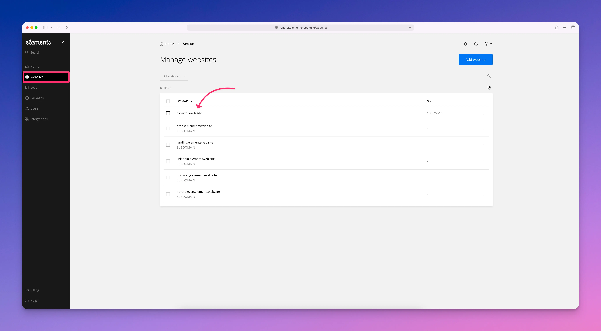
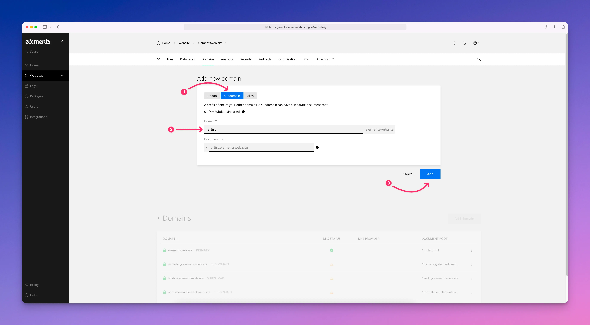
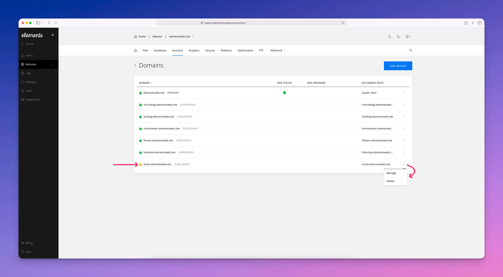

# Subdomains

A **subdomain** is a way to create a separate section of your website using your existing domain name. For example, if your main website is `yourwebsite.com`, a subdomain could be something like `blog.yourwebsite.com` or `shop.yourwebsite.com`.

When you create a subdomain in the Elements Hosting Reactor Panel, it gets its own folder to store files. This lets you use it for a blog, store, or any other part of your site, while still being connected to your main website.

To add a subdomain to your Elements Hosting account, follow the steps below.

#### Step 1

Log into the [Elements Hosting Reactor Panel](https://reactor.elementshosting.io/login) and click on `Websites` in the sidebar, then click on the website you'd like to add a subdomain to.

<figure><figcaption></figcaption></figure>

#### Step 2

Click on `Domains` in the top menu, then click on the blue `Add domain` button.

<figure><figcaption></figcaption></figure>

#### Step 3

Select `Subdomain`, then in the `Domain*` field enter your desired subdomain. The `Document root` field will be auto-filled as you type your subdomain. We recommend leaving this as-is as this is the folder where your subdomain's website files should be uploaded to.&#x20;

When finished click the blue `Add` button.

<figure><figcaption></figcaption></figure>

#### Step 4

You will now see your subdomain listed in your Domains list.&#x20;

Click on `...` in order to:

* Manage your subdomain's document root folder
* Delete your subdomain if needed


If your subdomain's DNS is not yet pointed to your Elements Hosting account's IP address, you will see a yellow padlock next to it indicating a Let's Encrypt SSL certificate has not yet been issued for it.

Once you point the DNS for your subdomain to your Elements Hosting account's IP address, a new Let's Encrypt SSL certificate will be auto-provisioned and you will then see a green padlock next to it in the list, indicating your website is SSL secured!


<figure><figcaption></figcaption></figure>
