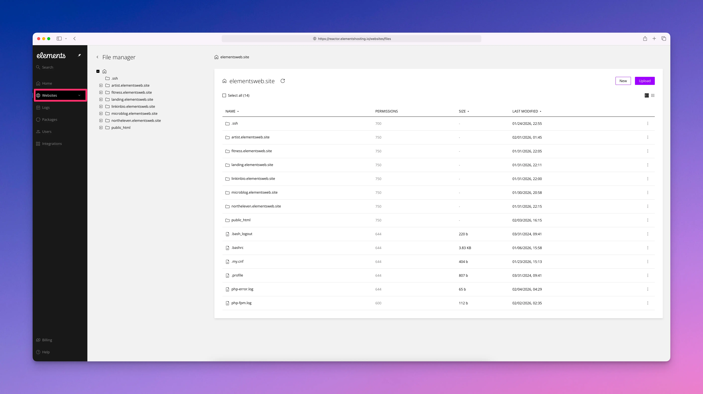
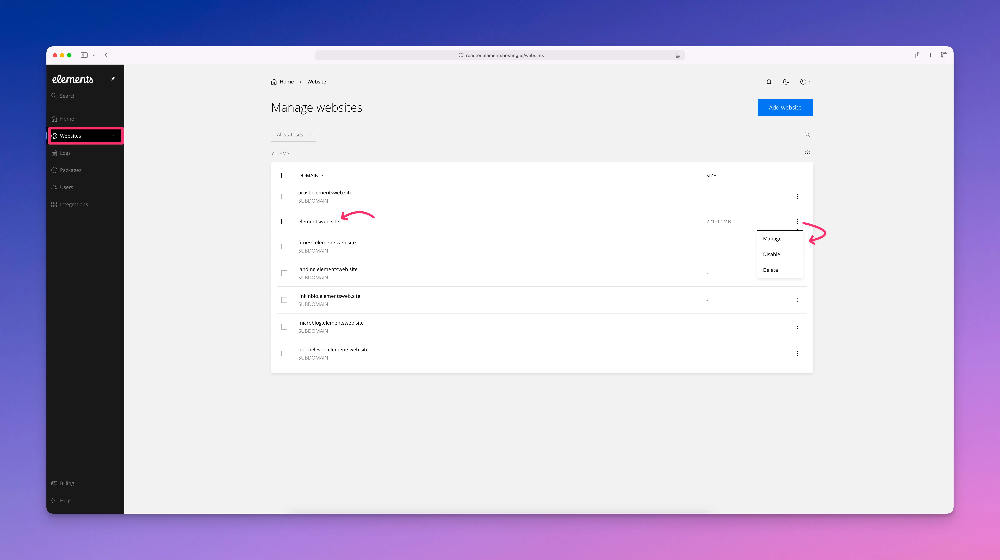
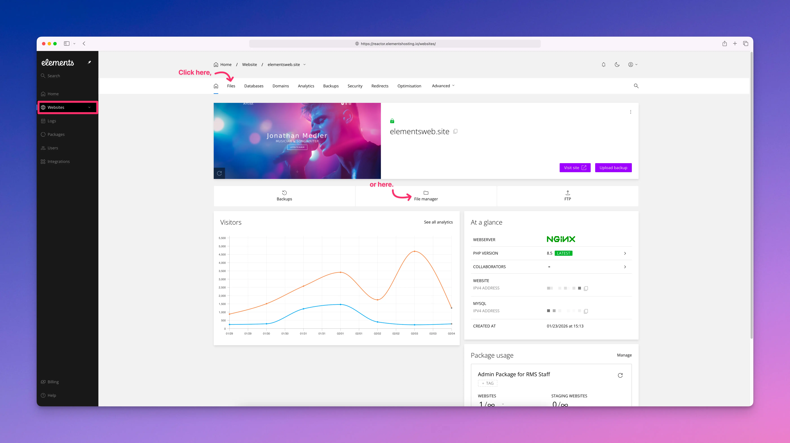
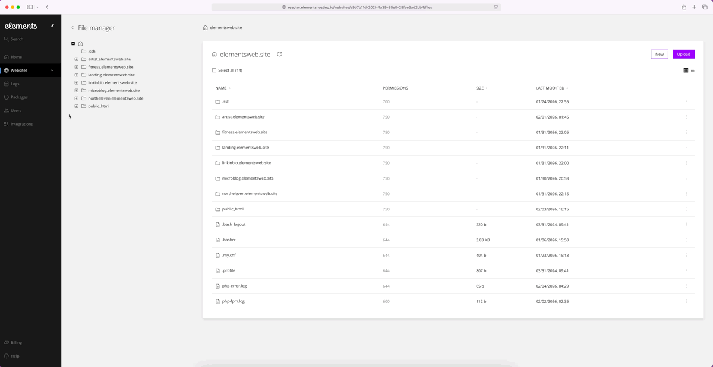
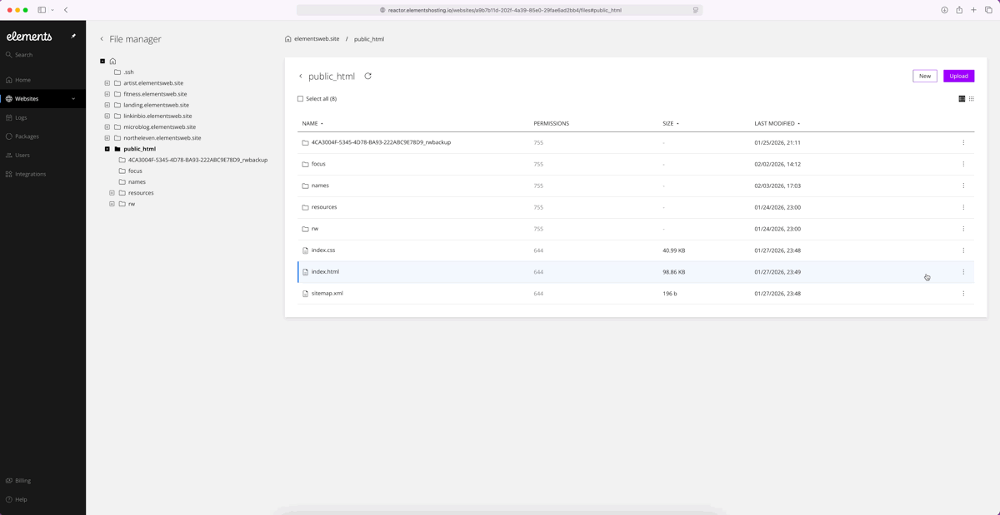
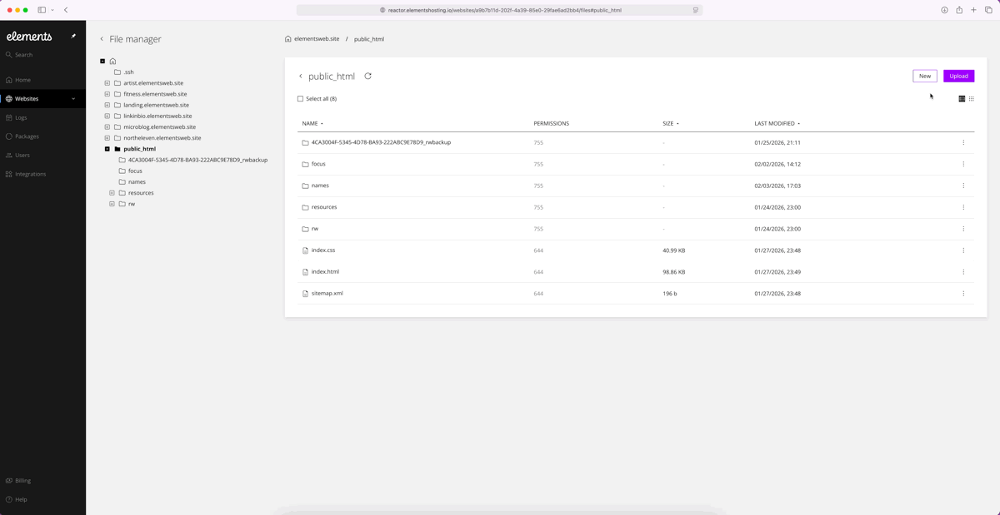

# Files

<figure><figcaption></figcaption></figure>

Our built-in file manager makes managing your files and folders quick and easy. You can create new files or folders, upload your files, edit documents, and download files whenever needed.

It also lets you move, rename, delete, and organize your files smoothly.

You can compress files to save space or uncompress them when needed, and easily check or change permissions if necessary.

Access is secure, only available to the account owner or authorized FTP/account users.

This tool simplifies your file management tasks, saving you time and effort.

To use the built-in file manager, following the below steps:

#### Step 1

Log into the [Elements Hosting Reactor Panel](https://reactor.elementshosting.io/), click on `Websites` in the sidebar menu, click on the website you'd like to access the File Manager for, or click on `...` to the right and select `Manage` from the drop-down menu.

<figure><figcaption></figcaption></figure>

#### Step 2

Click on `Files` in the top navigation menu, or the `File Manager` icon below.

<figure><figcaption></figcaption></figure>

#### Step 3

You are now in Elements Hosting's built-in File Manager, where you can easily work with your website's files and folders quickly and conveniently.

**View file menu options**

<figure><figcaption></figcaption></figure>

**Download a file to your Mac**

<figure><figcaption></figcaption></figure>

**Change file permissions**

<figure><figcaption></figcaption></figure>

**Upload a file and then delete the file**

<figure><figcaption></figcaption></figure>


These are just some actions you can perform in our built-in File Manager. If you have any questions on how to use the File Manager, please don't hesitate to ask on our [Community Forum](https://forums.realmacsoftware.com/c/rapidweaver-elements/hosting/65), or contact us via our support email.

