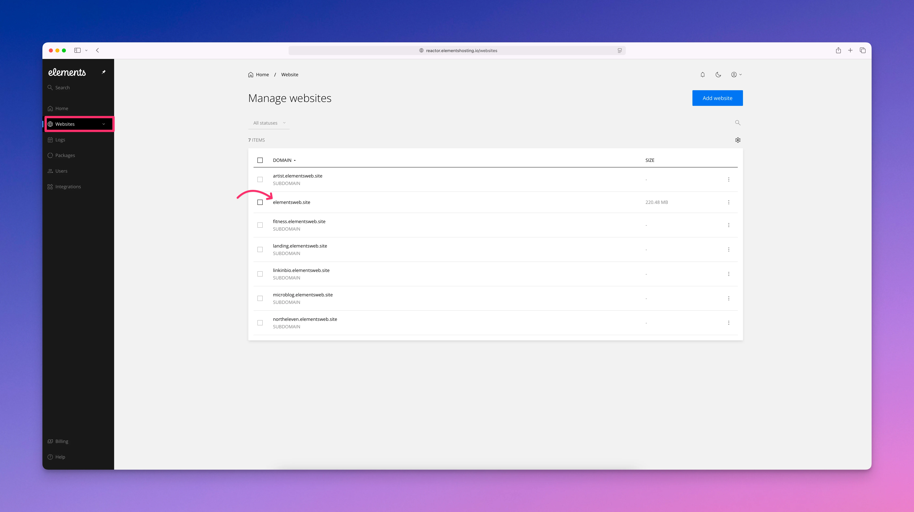
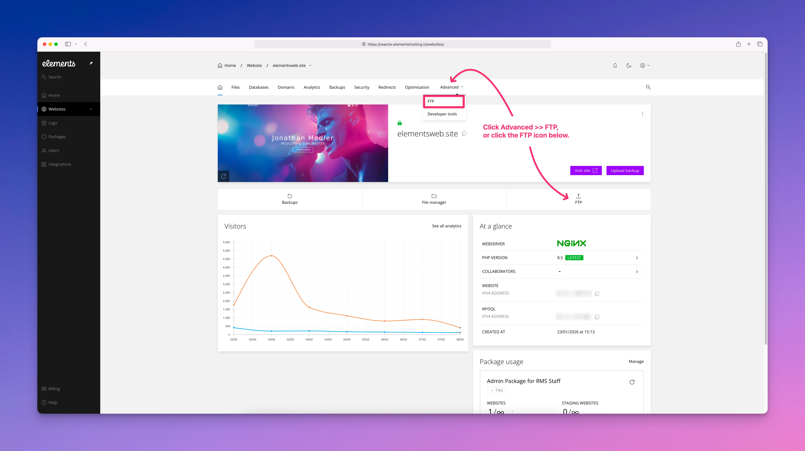
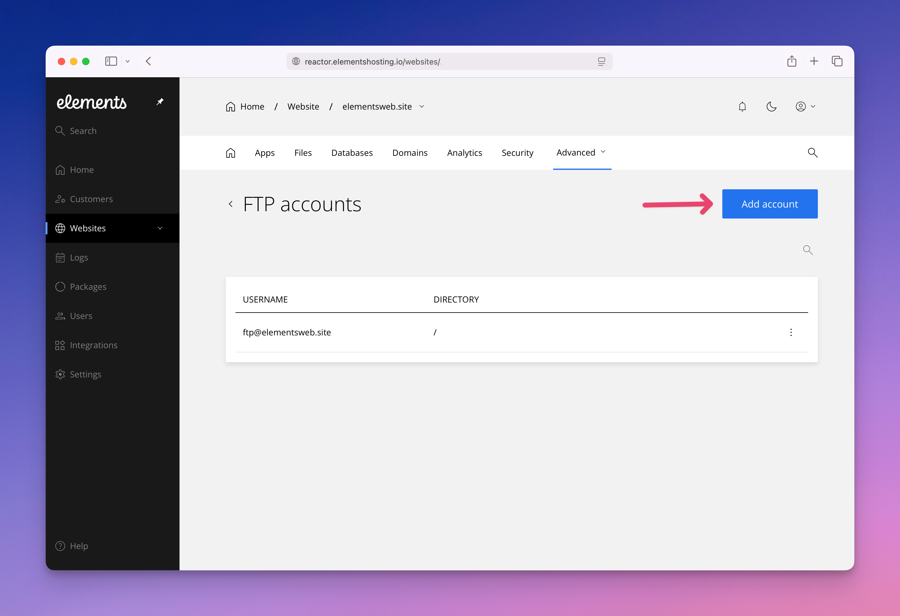
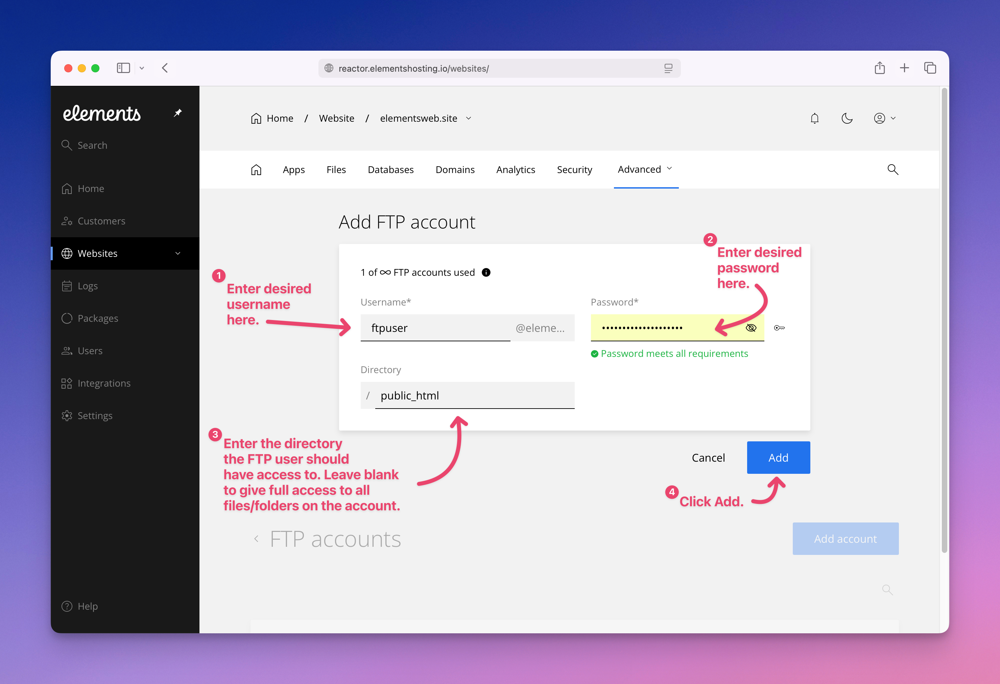
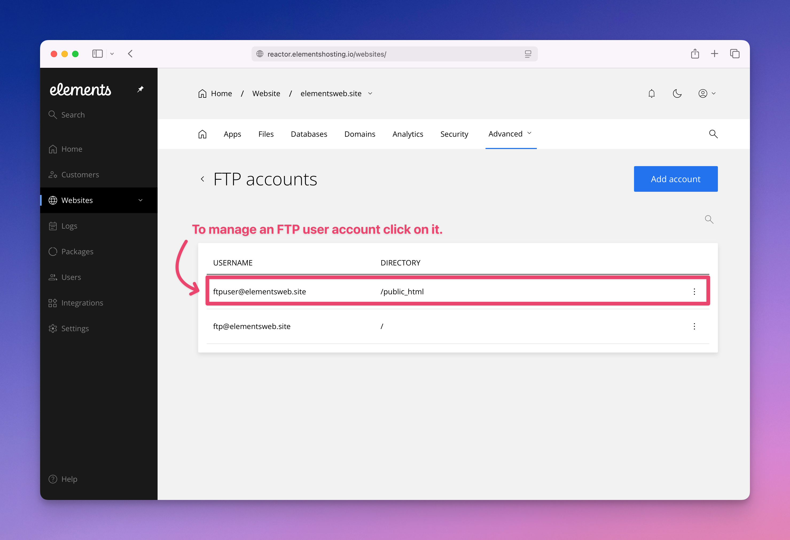
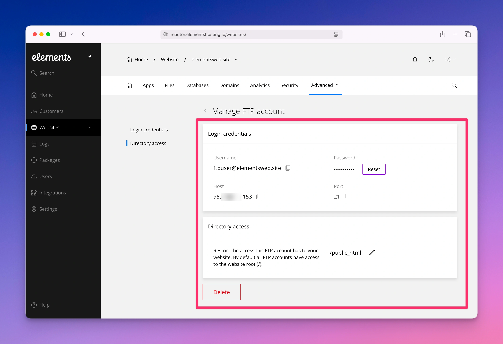
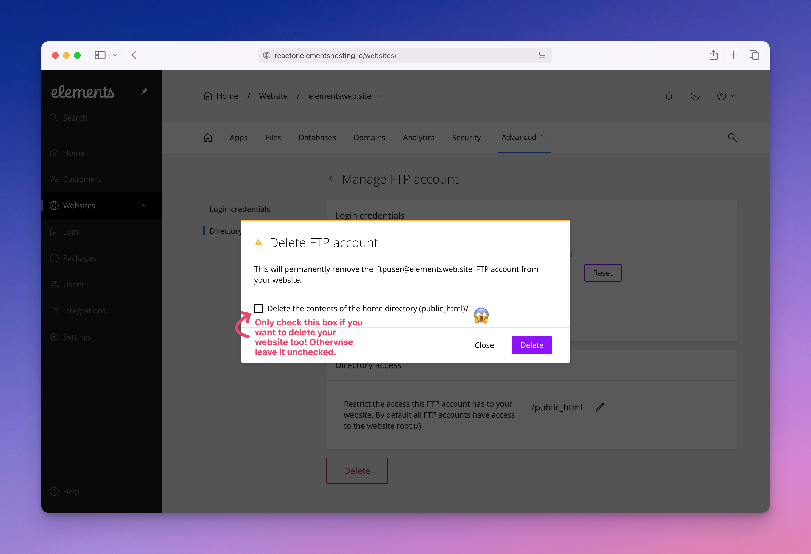

# How to create an FTP account.

Elements Hosting allows you to create FTP user accounts to manage your website's files and folders. With an FTP user account you can upload, download, edit, delete, and view all your website's files and folders on your hosting account.

To add a new FTP user follow the below steps.

#### Step 1

Log into the [Elements Hosting Reactor Panel](https://reactor.elementshosting.io/login) and click on `Websites` in the sidebar, then click on the website you'd like to add an FTP user to.

<figure><figcaption></figcaption></figure>

#### Step 2

Click on `Advanced` >> `FTP`, **or** click on the FTP icon as shown in the screenshot. Both options will take you to the same place.

<figure><figcaption></figcaption></figure>

#### Step 3

Click on the `Add account` button.

<figure><figcaption></figcaption></figure>

#### Step 4

Enter your:

1. Desired FTP username
2. Desired FTP Password
3. The directory/folder you'd like this FTP user to have access to

&#x20;Then click `Add` when finished.

<figure><figcaption></figcaption></figure>


Congratulations! Your new FTP user account has been successfully created and is now ready for use. 🎉


#### Additional Information

To manage an FTP user account and view its login credentials, click on the FTP user you'd like to manage.

<figure><figcaption></figcaption></figure>

From here you can perform the following actions:

* View/copy your FTP Username.
* Reset your FTP user password.
* View/copy your FTP host/server IP address.
* View/copy your FTP port.
* Modify the directory/folder your FTP user has access to.
* **Delete** your FTP user.

<figure><figcaption></figcaption></figure>


When deleting an FTP user account, pay attention to the option “**Delete the contents of the home directory?**” Leave this unchecked if you want to keep your website and all other files.

Check the box only if you want to remove everything, including the FTP user, your website, and all files in your hosting account.

Even though we maintain backups, deleting everything may result in the loss of recent changes. Always proceed with caution when removing data from your hosting account.


<figure><figcaption></figcaption></figure>
