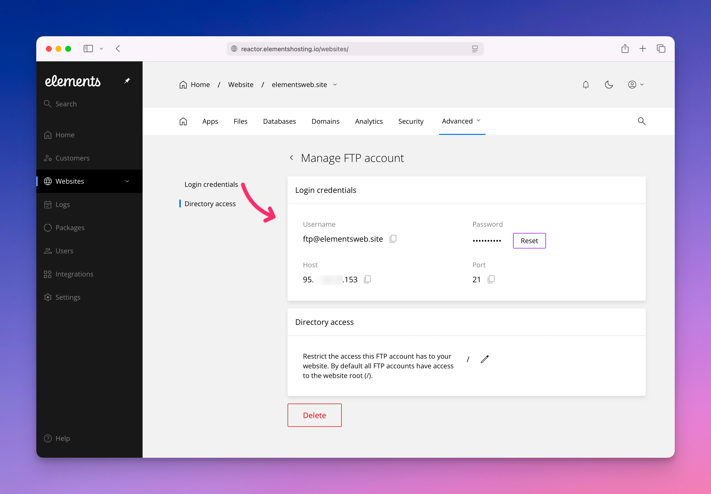
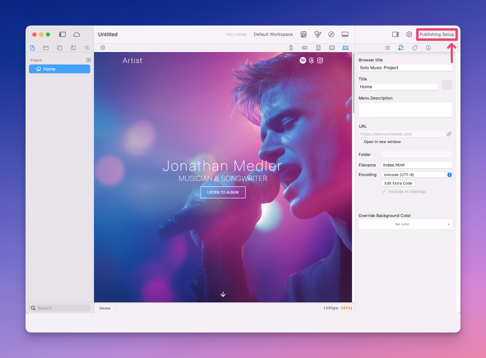
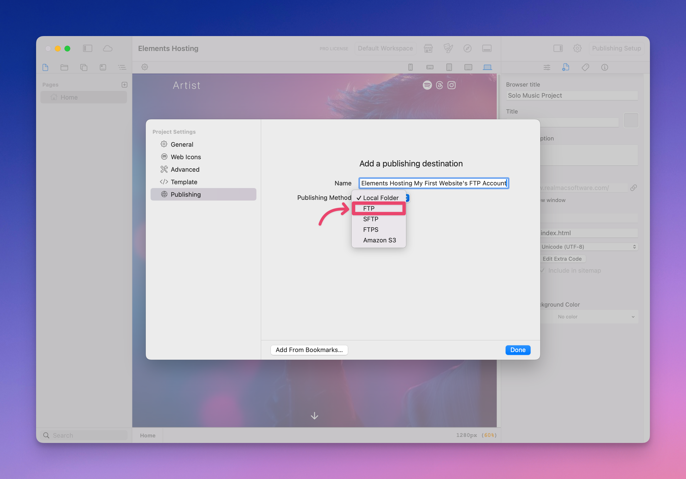
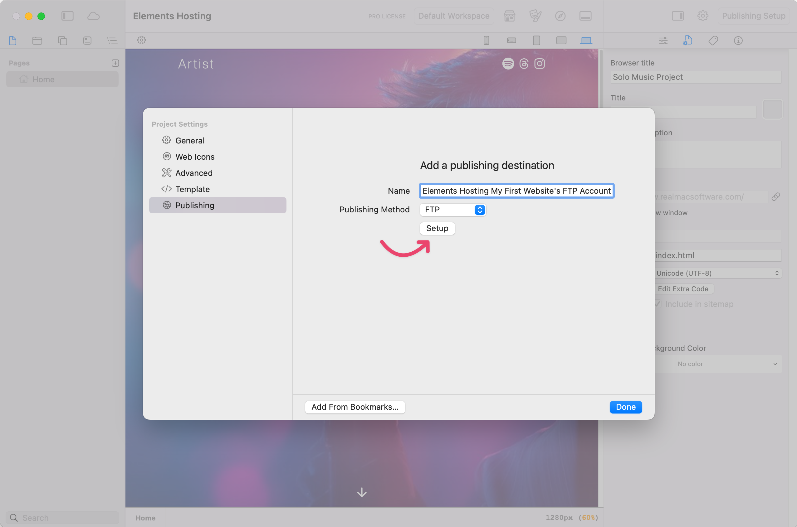
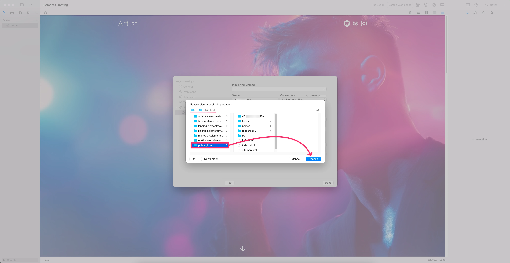
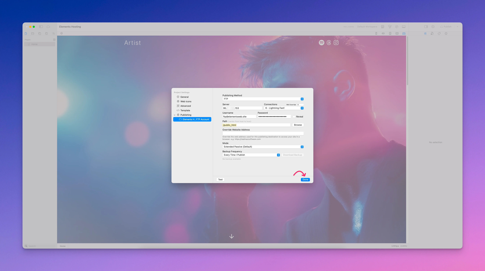
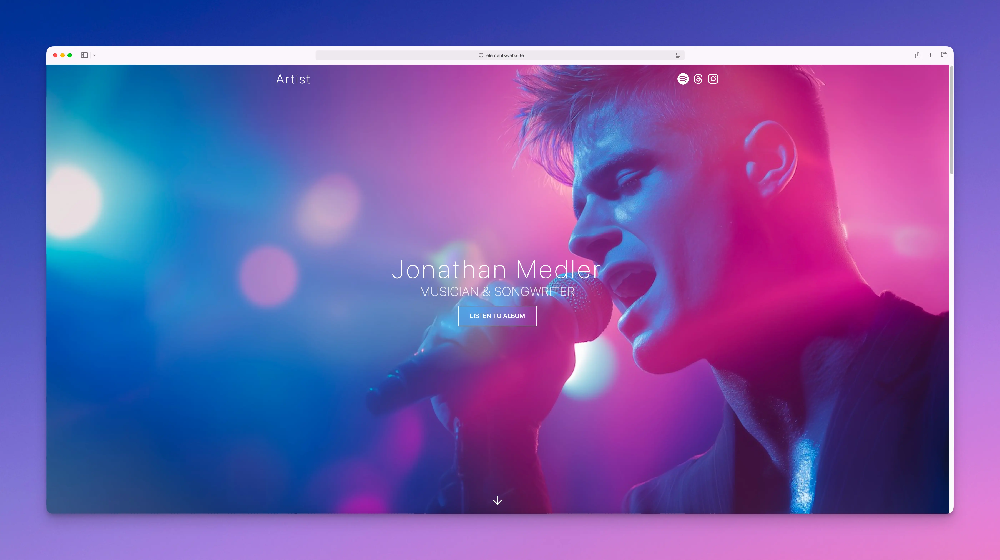

# How to publish your Elements site using FTP

Publishing from the Elements App to your Elements Hosting account has been designed to be fast and easy.

Below are the steps to publish your Elements sites using FTP.

#### Step 1

Log into the [Elements Hosting Reactor Panel](https://reactor.elementshosting.io/login) and navigate to the FTP user you'd like to use for publishing/uploading your site via the Elements App.

Take note of the following:

* FTP Username
* FTP Password
* FTP Host
* Directory Access - Pay attention if your FTP user has access to the root folder `(/)`, or if they only have access to a specific website's home folder, such as `/public_html`. In the below screenshot, our FTP user has access to the root folder, meaning they have access to all sites hosted under that account.

<figure><figcaption></figcaption></figure>

#### Step 2

In the Elements App, click on `Publishing Setup` in the upper right-hand corner of the app window.

<figure><figcaption></figcaption></figure>

#### Step 3

Give your publishing destination a name in the `Name` field, and select `FTP` from the `Publishing Method` drop-down menu.

<figure><figcaption></figcaption></figure>

#### Step 4

Click the `Setup` button.

<figure><figcaption></figcaption></figure>

#### Step 5

Enter your FTP user details from [Step 1 above](how-to-publish-your-elements-site-using-ftp.md#step-1).

1. **Publishing Method:** FTP
2. **Server:** Your Host/Server IP Address
3. **Connections:** 1 (very slow) to 6 (very fast)
4. **Username:** Your FTP Username
5. **Password:** Your FTP Password

Click the `Test` button in the lower-left of the window to confirm you've entered your FTP connection details correctly. You will see a pop-up window telling you if the connection test was successful, or if it failed. If it fails, please double-check your FTP connection details, that they are entered correctly, and test again.

<figure><figcaption></figcaption></figure>

#### Step 6

Next, in the `Path` field, select the folder where your website will be uploaded to by clicking the `Browse` button, selecting that upload folder, clicking the `Choose` button, then clicking the `Done` button.

Generally public\_html will be what's entered in the `Path` field if you are only hosting one website with us. If you are hosting multiple websites on your Elements Hosting account, you will need to make sure you select the correct folder to upload to. When in doubt, ask us. 🙂


From [Step 1 above](how-to-publish-your-elements-site-using-ftp.md#step-1), if your FTP User's **Directory Access** is already listed as the website's upload folder (e.g. `public_html`), then you don't have to enter anything in the `Path` field in Elements Publishing Settings (leave it blank).


<figure><figcaption></figcaption></figure>

<figure><figcaption></figcaption></figure>

<figure><figcaption></figcaption></figure>

#### Step 7

When you are ready, click `Publish` in the upper right-hand corner of the window, and watch as your website gets published to your Elements Hosting account! 🎉

<figure><figcaption></figcaption></figure>


You can now open up your web browser and witness the Power of Elements™️, no magic-wand required! 🧙


<figure><figcaption></figcaption></figure>
