# How to publish your Elements site using SFTP

Publishing from the Elements App to your Elements Hosting account via SFTP has been designed to be safe and secure (as well as fast)!

Below are the steps to publish your Elements sites securely using SFTP.

#### Step 1

Log into the [Elements Hosting Reactor Panel](https://reactor.elementshosting.io/login), click on `Websites` in the sidebar menu, select the website you'd like to publish to via SFTP, click on `Advanced` in the top menu bar, then select `Developer Tools` from the drop-down menu.

Scroll down to the `SSH password authentication` section.

<figure><figcaption></figcaption></figure>

#### Step 2

Take note of the following:

1. SFTP Username
2. SFTP Server IP Address/Host
3. SFTP Password (if you don't know your SFTP password you can reset it here)

<figure>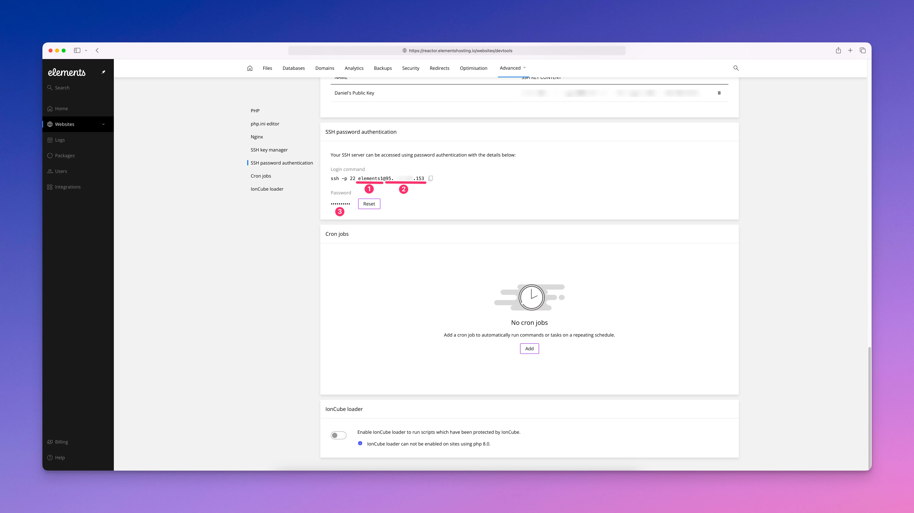<figcaption></figcaption></figure>

#### Step 3

In the Elements App, click on `Publishing Setup` in the upper right-hand corner of the app window.

<figure>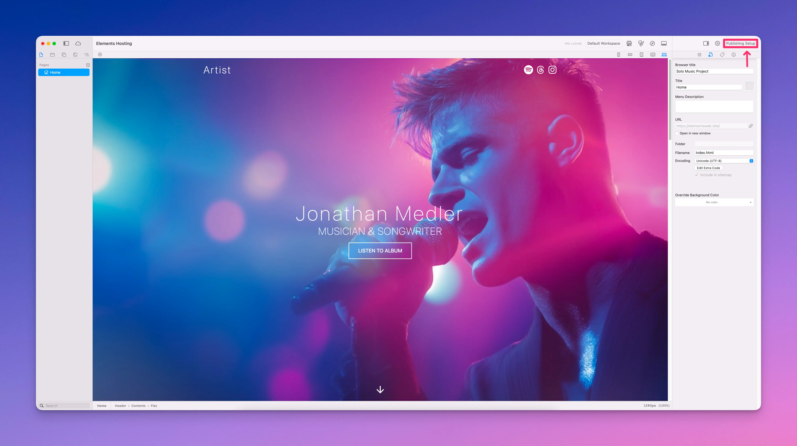<figcaption></figcaption></figure>

#### Step 4

Give your publishing destination a name in the `Name` field, and select `SFTP` from the `Publishing Method` drop-down menu.

<figure>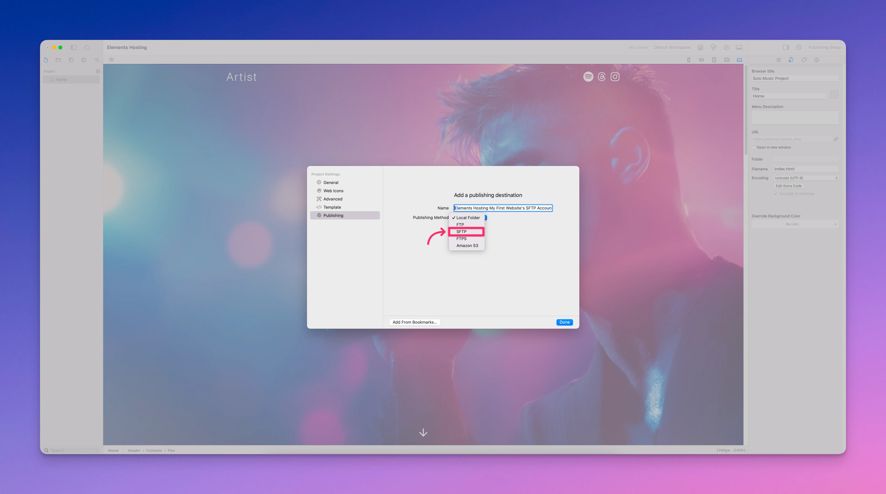<figcaption></figcaption></figure>

#### Step 5

Click the `Setup` button

<figure>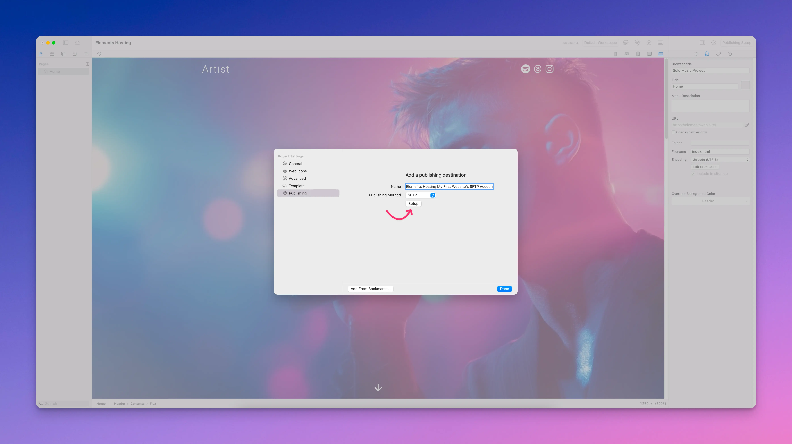<figcaption></figcaption></figure>

#### Step 6

Enter your SFTP user details from [Step 2 above](how-to-publish-your-elements-site-using-sftp.md#step-2).

* **Publishing Method:** SFTP
* **Server:** Your Host/Server IP Address
* **Connections:** 1 (very slow) to 6 (very fast)
* **Username:** Your SFTP Username
* **Password:** Your SFTP Password

<figure>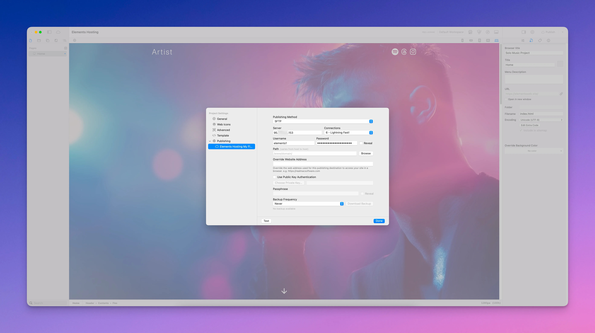<figcaption></figcaption></figure>

Click the `Test` button in the lower-left of the window to confirm you've entered your SFTP connection details correctly. You will see a pop-up window telling you if the connection test was successful, or if it failed. If it fails, please double-check your SFTP connection details, that they are entered correctly, and test again.

<figure>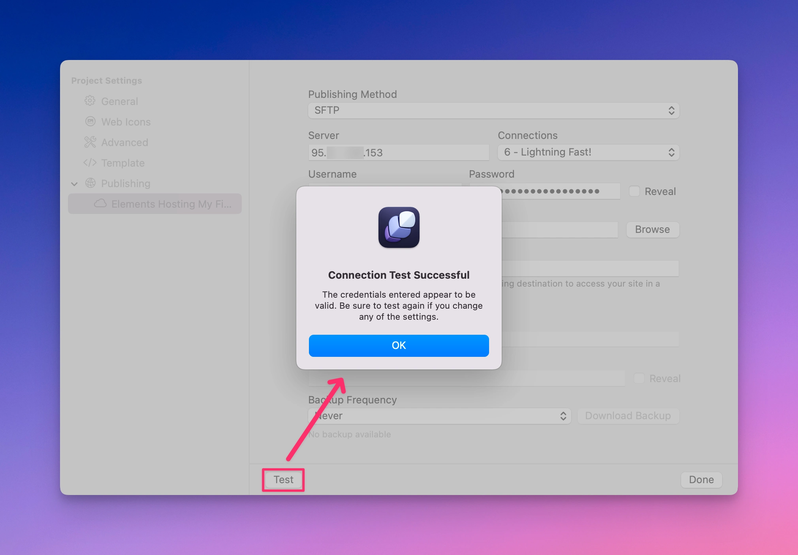<figcaption></figcaption></figure>

#### Step 7

Next to the `Path` field, click the the `Browse` button.

<figure>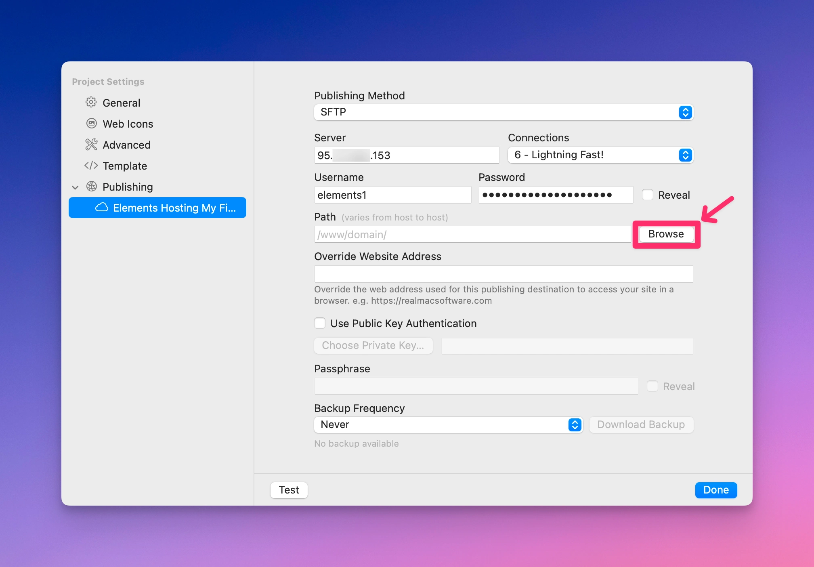<figcaption></figcaption></figure>

Select the folder where your website files should be uploaded to (usually **public\_html** if you are only hosting 1 website on the account), then click the `Choose` button.


If you are hosting multiple websites on your Elements Hosting account, you will need to make sure you select the correct folder to upload to. When in doubt, ask us. 🙂


<figure>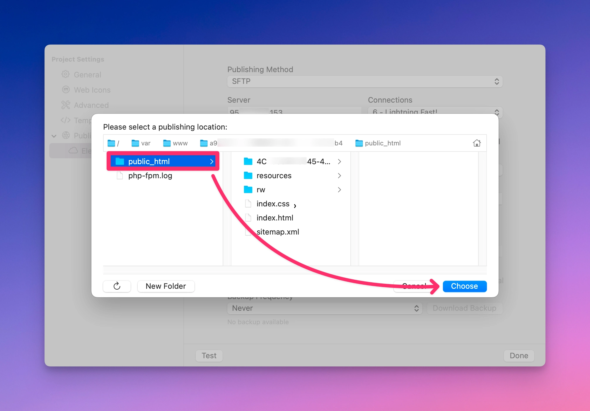<figcaption></figcaption></figure>

Finally click the `Done` button.

<figure>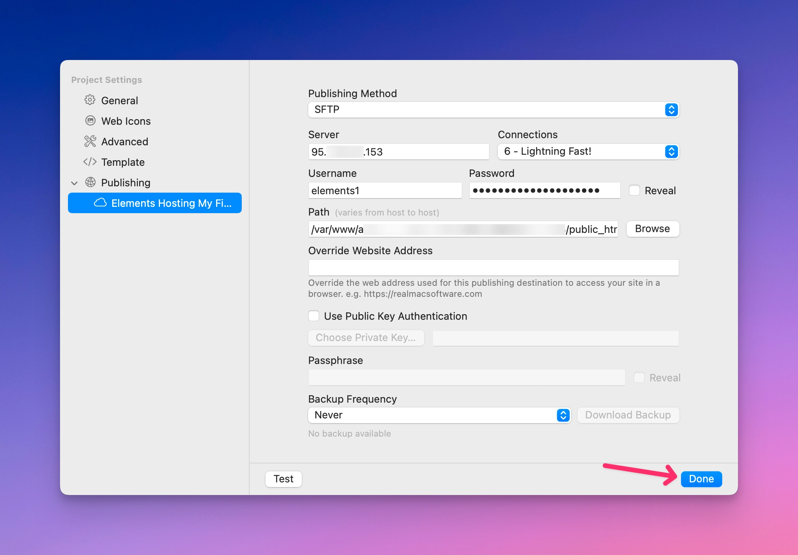<figcaption></figcaption></figure>

#### Step 8

When you are ready, click `Publish` in the upper right-hand corner of the window, and watch as your website gets published to your Elements Hosting account! 🎉

<figure>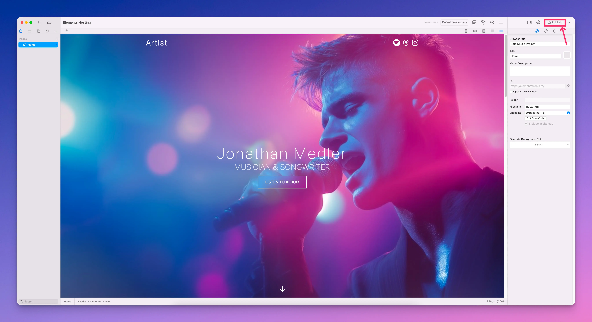<figcaption></figcaption></figure>

<figure>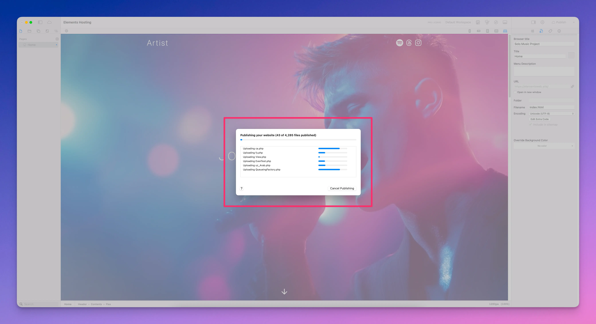<figcaption></figcaption></figure>

You can now visit your website in your browser, resting easy knowing it was uploaded safely and securely to your Elements Hosting account. 🔒

<figure><figcaption></figcaption></figure>
