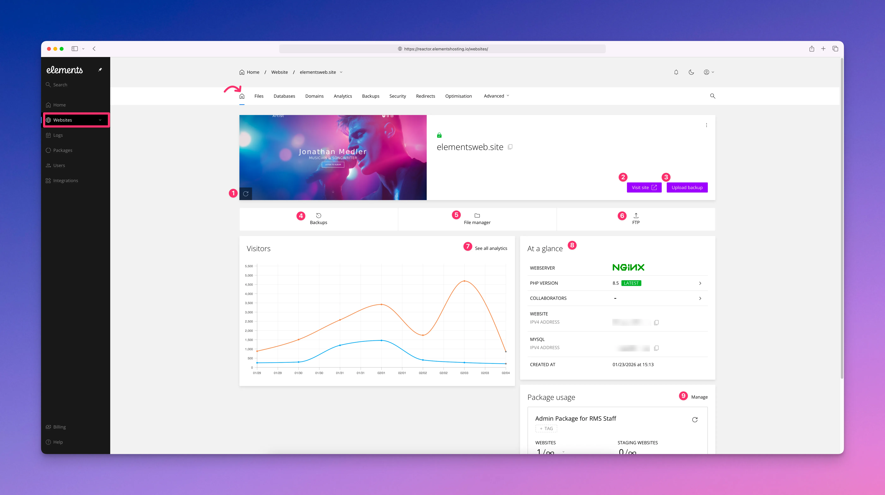

# Home

<figure><figcaption></figcaption></figure>

From your website’s Home dashboard in the [Elements Hosting Reactor Panel](https://reactor.elementshosting.io/), you can view the following information and perform the following actions:

1. Refresh the dashboard screenshot if your website’s home page has changed. This screenshot is for visual reference only and does not affect site functionality.
2. Click `Visit site` to open your website’s URL in a new browser tab or window.
3. Upload and restore a website backup by selecting `Upload backup`, if you have a backup file available.
4. Click `Backups` to open the Backups section, where you can view existing backups, create a new backup, or restore from a previous backup.
5. Click `File manager` to open the [Files](files.md) page and manage your website’s files and folders.
6. Click `FTP` to open the [FTP](ftp-accounts/) page, where you can create, manage, or delete FTP user accounts.
7. Click `See all analytics` to open the [Analytics](analytics.md) page, where you can view total bandwidth usage and visitor statistics.
8. Review the At a Glance section, which displays:\
   a. The web server in use on your hosting account\
   b. The active PHP version for your website, which can be changed from this section\
   c. Any collaborators who have access to your hosting account\
   d. Your website and database IP addresses\
   e. The date your website was added to your hosting account
9. View the hosting package your website is subscribed to, along with current package usage and resource information.
