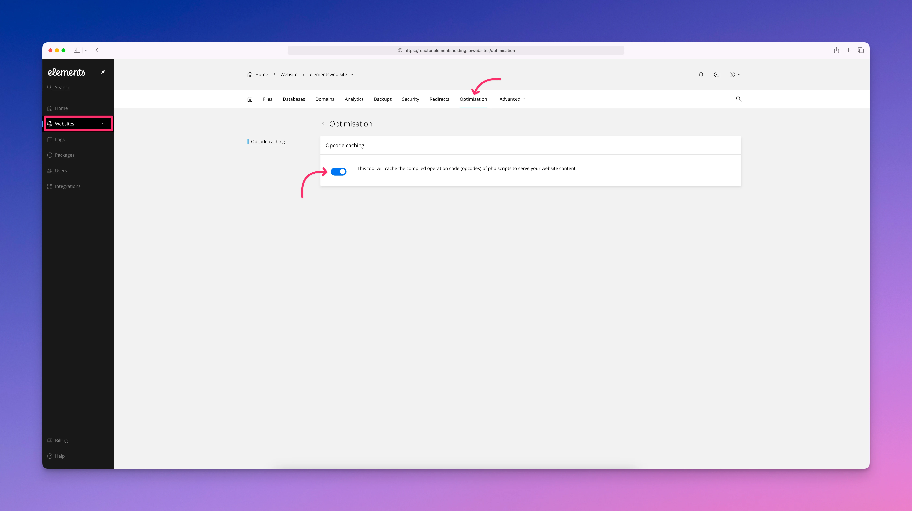

# Optimization

<figure><figcaption></figcaption></figure>


**tl;dr**: Keep this setting enabled, there is effectively no downside and it provides clear performance benefits.


### What OPcache is

OPcache is a PHP optimization feature that speeds up how PHP code runs on your site.

Normally, every time PHP is executed, the server must read the PHP file, analyze the code, compile it into low-level instructions, and then run it. This process happens on every request.

With OPcache enabled, PHP is compiled once and the compiled code is stored in server memory. Future requests reuse this already-compiled code instead of repeating the compilation process.

### Why OPcache matters on Elements Hosting

Elements Hosting uses PHP-FPM to run PHP for supported features such as contact forms, our Blog/CMS system, certain components, and other dynamic functionality used by RapidWeaver Elements sites.

OPcache reduces the work PHP needs to do for each request, which results in faster execution and lower CPU usage. This helps keep sites responsive and stable, especially during traffic spikes.

### How it affects RapidWeaver sites

Most RapidWeaver Elements sites are primarily static HTML, which is already very fast. However, PHP is still used for common features such as:

* Contact form pages
* Blog/CMS pages
* Other pages/components requiring the .php extension to work properly

When OPcache is enabled, these PHP components execute more efficiently, improving page interactions and form responsiveness without changing how your site works.

### What OPcache does and does not do

OPcache improves PHP execution speed, but it is important to understand its scope.

OPcache does:

* Speed up PHP execution
* Reduce CPU usage
* Improve performance consistency under load

OPcache does not:

* Cache HTML pages
* Skip PHP execution
* Reduce database queries

Your PHP code still runs on every request. It simply runs faster because it does not need to be recompiled each time.

### Recommended setting

OPcache should be enabled for all production sites hosted on Elements Hosting.

For RapidWeaver Elements sites, there is effectively no downside and clear performance benefits.
