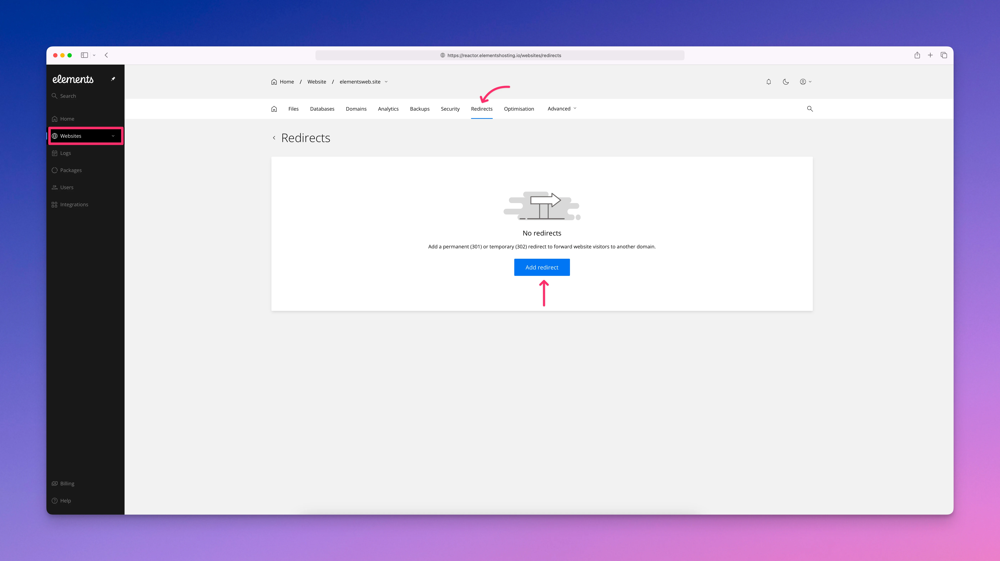
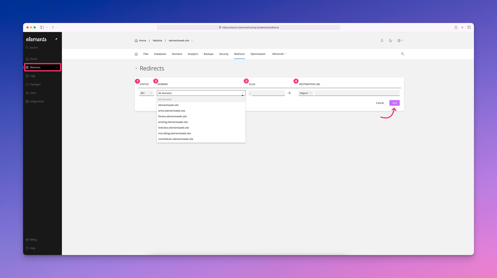

# Redirects

The Redirects section allows you to control how visitors and search engines are redirected when accessing specific URLs on your website. Redirects are commonly used when pages are moved, URLs change, or you want to send visitors from one address to another without breaking existing links.

Elements Hosting supports both 301 and 302 redirects. A 301 redirect is a permanent redirect and tells search engines that a page has moved permanently to a new location. This is the preferred option when changing URLs long term, as it helps preserve search engine rankings. A 302 redirect is a temporary redirect and indicates that the original URL may be used again in the future. This is useful for short-term changes, testing, or maintenance scenarios.

Redirects are handled at the server level, which makes them fast and reliable. To set website redirects follow the below steps.

#### Step 1

Log into the [Elements Hosting Reactor Panel](https://reactor.elementshosting.io/), click on `Websites` in the sidebar menu, click `Redirects` from the top menu, then click the `Add redirect` button.

<figure><figcaption></figcaption></figure>

#### Step 2

From here you can add your website redirects.

1. **Status** - Select 301 for a permanent redirect, or 302 for a temporary redirect.
2. **Domain** - Select the domain you wish to redirect.
3. **Slug** - Enter the exact path of the domain you wish to redirect, for example if you had an About Us page at `https://elementsweb.site/about-us`, then `elementsweb.site` would be the domain, and `about-us` would be the slug.
4. **Destination URL** - Enter the the destination URL (where the redirect should direct to). This should be the full path, such as `https://elementsweb.site/about`.&#x20;

<figure><figcaption></figcaption></figure>

Once you have got your redirect entered correctly, click on the `Add` button. You can then test the old URL in your browser to make sure the redirect is working as expected. If not, you can come back to the redirects section to make any corrections and test again.


If you need any help setting up website redirects, don't hesitate to reach out to us and we can help you get those properly set up.

