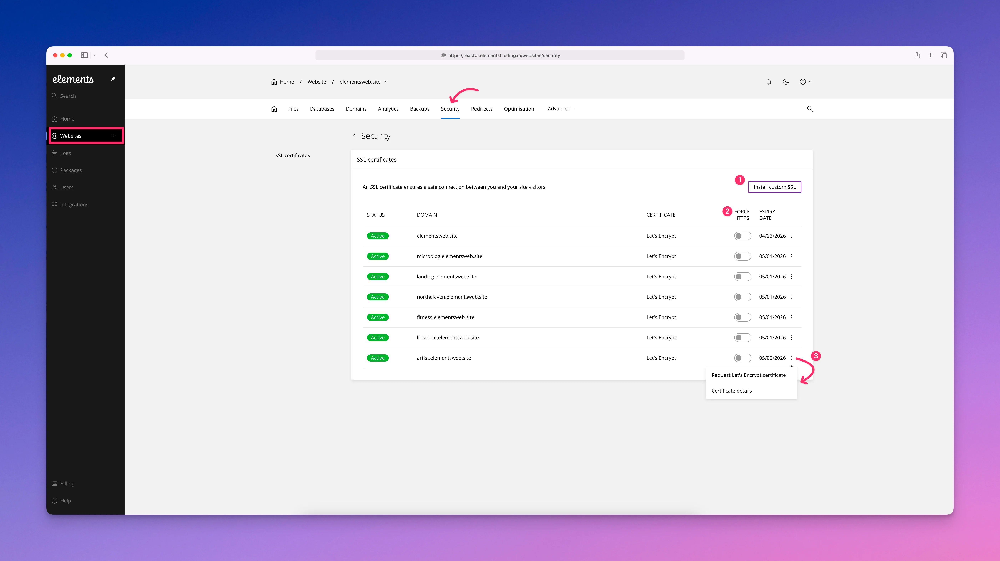

# Security

<figure><figcaption></figcaption></figure>

The Security section focuses on managing SSL certificates for your website(s). SSL certificates encrypt traffic between your site and its visitors, helping protect data and ensuring browsers mark your site as secure. On Elements Hosting, SSL certificates are handled automatically to reduce setup and ongoing maintenance.

Once Elements Hosting detects that your domain’s DNS is correctly pointed to our service, a free Let’s Encrypt SSL certificate is automatically issued and installed for your site. If the domain’s DNS has not been pointed yet, or DNS changes are still propagating, a temporary self-signed SSL certificate is used instead. As soon as the DNS is detected correctly, the Let’s Encrypt certificate is issued automatically and replaces the temporary certificate. No manual action is required.

From the Security section, you can also manage additional SSL-related options, such as:

1. Install a custom SSL certificate if you have purchased one separately
2. Force all web traffic to use HTTPS for improved security and consistency
3. Manually request or renew a Let’s Encrypt certificate if needed, as well as view your current SSL certificate's details.
