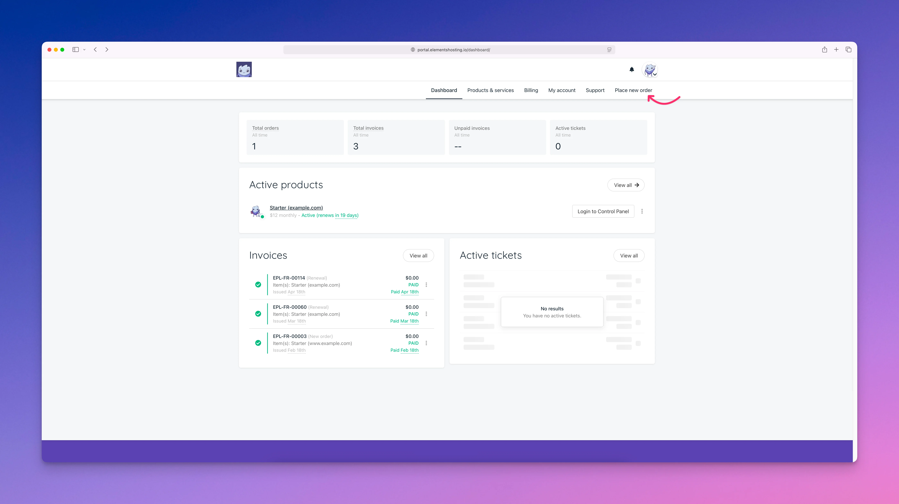
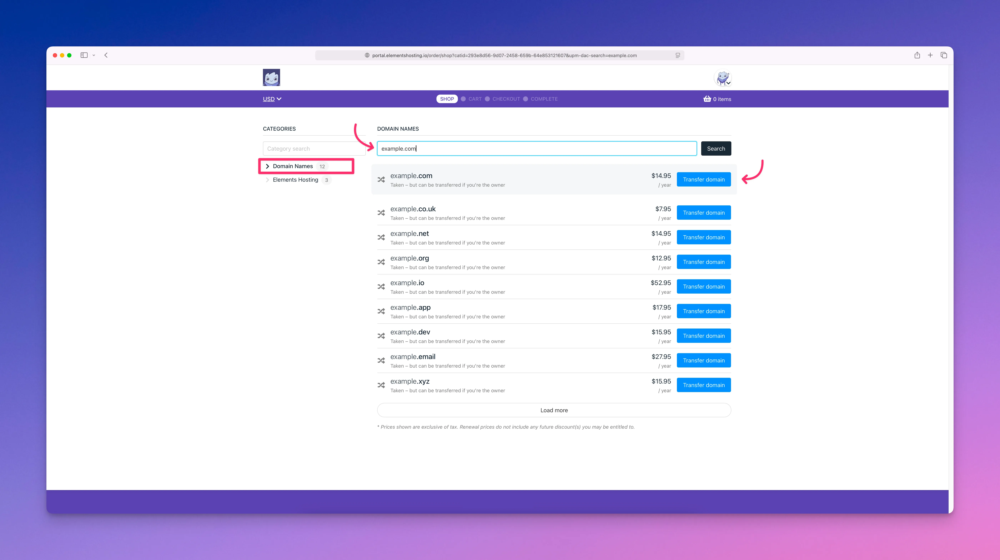
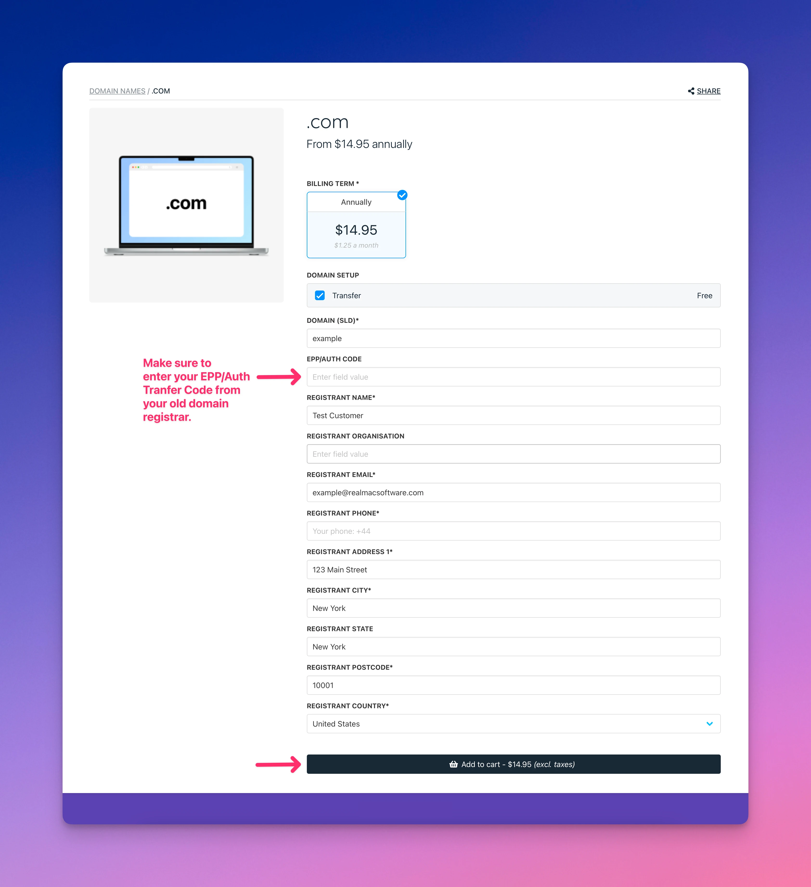

# Request Domain Name Transfer

If you would like to move your domain name registrations from your old domain registrar to Elements Hosting, below are the steps to get that transfer process started.

#### Step 1

Log into the [Elements Hosting Client Portal](https://portal.elementshosting.io/) and navigate to the **Place New Order** page.

<figure><figcaption></figcaption></figure>

#### Step 2

Enter your domain name that you would like to transfer over to us, then click the `Transfer domain` button.

<figure><figcaption></figcaption></figure>

#### Step 3

Fill in the domain transfer order form and click the `Add to cart` button when completed. Follow through the remaining checkout pages to complete your order.


Before submitting your domain transfer order, make sure you have **unlocked the domain** and that you have **requested the EPP/Auth Transfer code** at your old domain registrar. You will need to enter the EPP/Auth Transfer code on our domain transfer order form. We will not be able to start the transfer process without this code.


<figure><figcaption></figcaption></figure>
