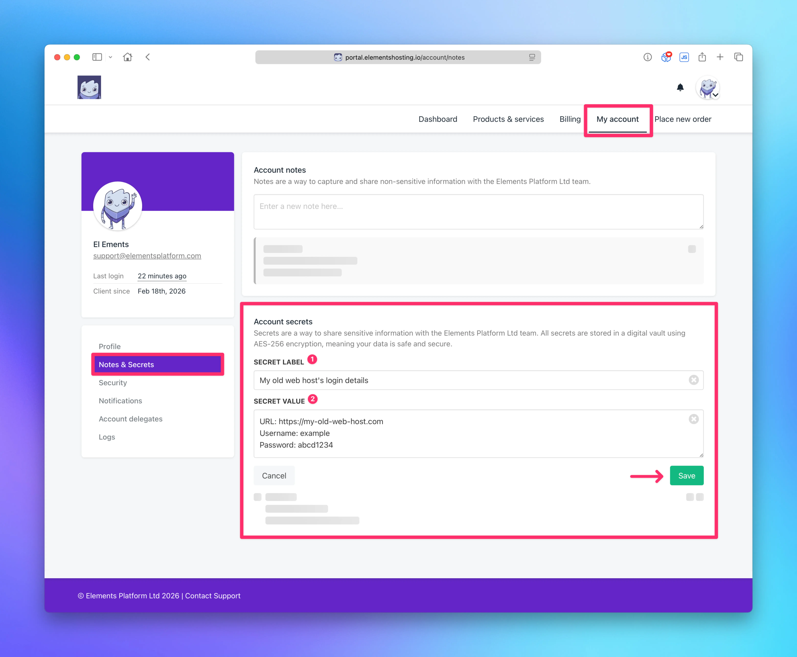
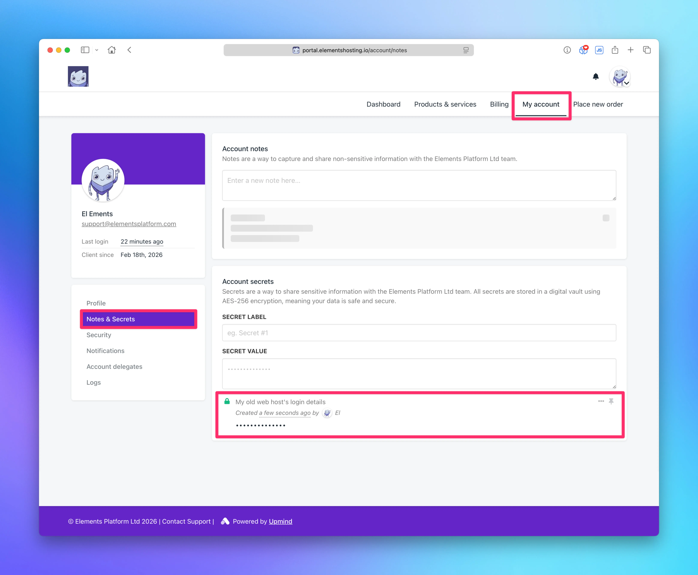

# Request Website Migration

If you are wanting to migrate your website over to us, we offer a free migration service for all Elements Hosting customers! 🎉

To request a free website migration, follow the below steps.

### Step 1 - Submit your login details to your old web host

Log into the [Elements Hosting Client Portal](https://portal.elementshosting.io/) and navigate to the **My Account** page. Select **Notes & Secrets** from the sidebar menu, then in the **Account Secrets** section enter your login details to your old web hosting provider (or your FTP/SFTP user credentials if you do not have login details to your old web host).

Click the `Save` button when complete.

<figure><figcaption></figcaption></figure>

<figure><figcaption></figcaption></figure>


If you need to make any edits to your submitted login details, or if you need to delete them, click on the `...` icon and select either **Edit** or **Delete**.



If you have two-factor authentication (2FA) enabled on your account at your old web hosting provider, please make sure to disable that so we can log into your account to start the migration process!


### Step 2 - Submit your migration request

Submit a support ticket to us at:

[Request a website migration](mailto:support@elementsplatform.com?subject=New%20Migration%20Request\&body=Hello,%0A%0AI%20would%20like%20to%20request%20a%20migration%20for%20the%20following%20websites:%0A%0A%0A%0A%0AI%20would%20like%20to%20schedule%20the%20migration%20to%20take%20place%20during%20this%20date%20and%20time:%0A%0A%0A%0A%0AI%20have%20submitted%20the%20login%20credentials%20to%20my%20old%20web%20hosting%20provider%20via%20the%20Client%20Portal.%0A%0AThanks!)

Make sure to include:

* The websites you would like migrated
* The date and time you'd like the migration to take place
* Confirmation you have submitted your login details to your old web hosting provider per [Step 1](request-website-migration.md#step-1-submit-your-login-details-to-your-old-web-host) so we can complete the migration.

After you submit your migration request, we will review it and follow up with next steps.

All migrations are handled on a first in, first out basis. We aim to complete all migrations within 1-2 business days, but can often get them done faster provided everything is in order and we don't need to request any additional information from you.
