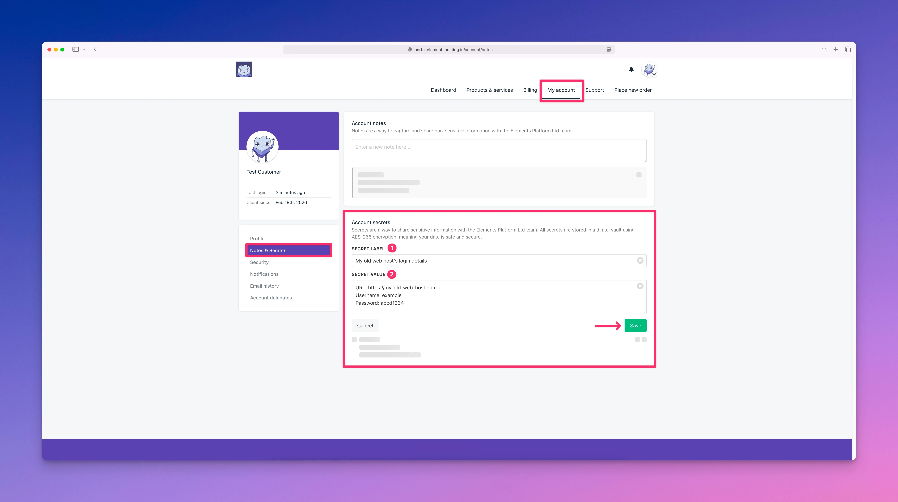
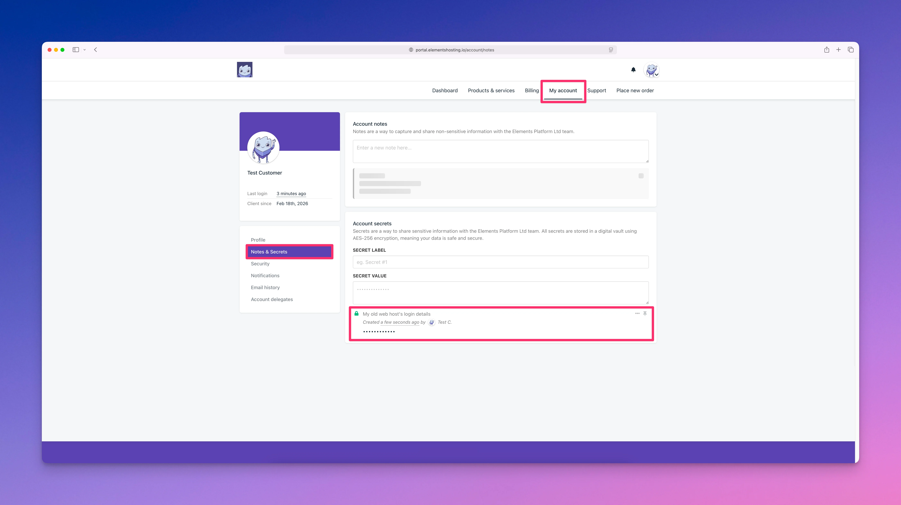
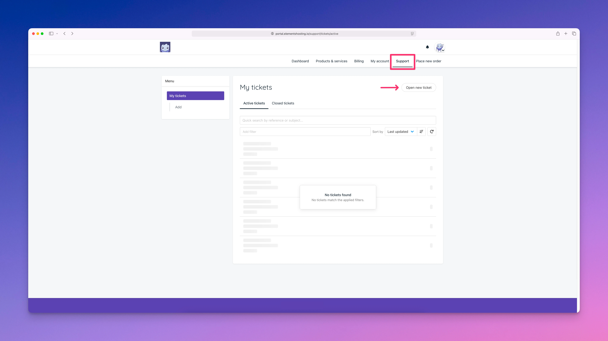
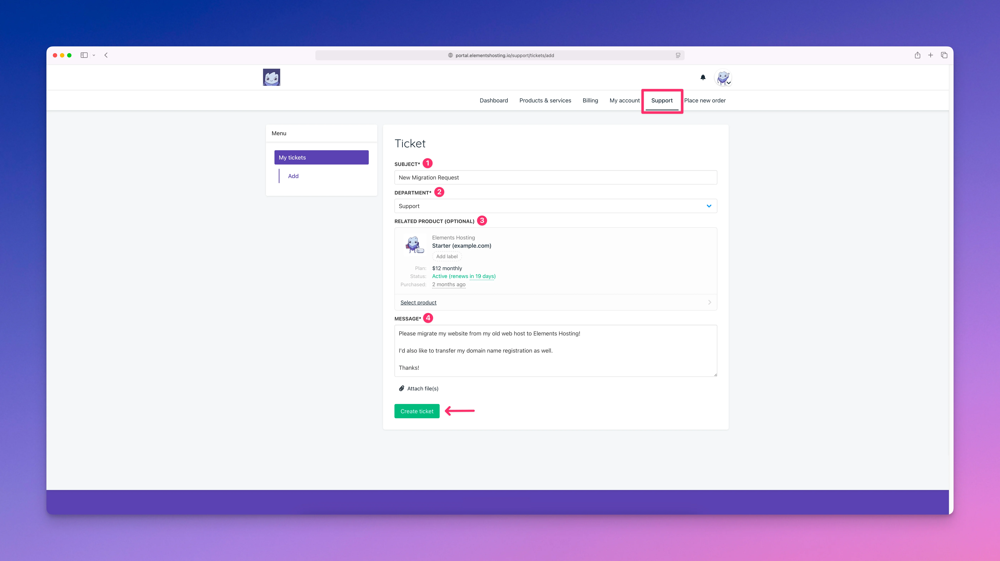

# Request Website Migration

If you are wanting to migrate your website over to us, we offer a free migration service for all Elements Hosting customers! 🎉

To request a free website migration, follow the below steps.

#### Step 1

Log into the [Elements Hosting Client Portal](https://portal.elementshosting.io/) and navigate to the **My Account** page. Select **Notes & Secrets** from the sidebar menu, then in the **Account Secrets** section enter your login details to your old web hosting provider (or your FTP/SFTP user credentials if you do not have login details to your old web host).

Click the `Save` button when complete.

<figure><figcaption></figcaption></figure>

<figure><figcaption></figcaption></figure>


If you need to make any edits to your submitted login details, or if you need to delete them, click on the `...` icon and select either **Edit** or **Delete**.



If you have two-factor authentication (2FA) enabled on your account at your old web hosting provider, please make sure to disable that so we can log into your account to start the migration process!


#### Step 2

Next, head over to the **Support** page and click the `Open new ticket` button.

<figure><figcaption></figcaption></figure>

Submit a new support ticket as follows:

1. **Subject** - New Migration Request
2. **Department** - Support
3. **Related Product (Optional)** - Select the web hosting plan you'd like us to migrate your website to.
4. **Message** - Let us know you are ready to start the migration process, along with any additional information such as the website(s) that you would like for us to migrate, and special details we should know about, any specific time you'd like for us to start the migration process, etc.

<figure><figcaption></figcaption></figure>

After you submit your migration request, we will review it and follow up with next steps.

All migrations are handled on a first in, first out basis. We aim to complete all migrations within 1-2 business days, but can often get them done faster provided everything is in order and we don't need to request any additional information from you.
