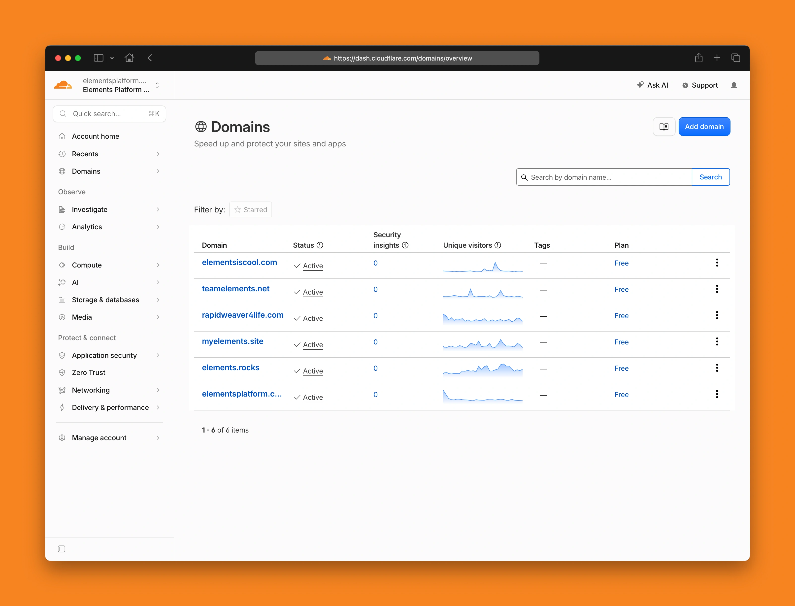

# Domains

<figure><figcaption></figcaption></figure>

The Domains page lists all of the websites that have been added to your Elements Hosting account.

Each domain listed here represents a website that you can manage using Cloudflare. From here, you can open an individual domain to configure features such as caching, performance, security, SSL/TLS settings, analytics, and more.

To manage a website:

1. Locate the domain you want to manage.
2. Select the domain name to open its Cloudflare dashboard.
3. Choose the Cloudflare feature you want to configure from the navigation menu.

Each website has its own independent Cloudflare settings, allowing you to customize performance and security on a per-domain basis.


If your hosting account includes multiple websites, each one will appear separately in the Domains list. Changes made to one website do not affect any other websites in your account.

