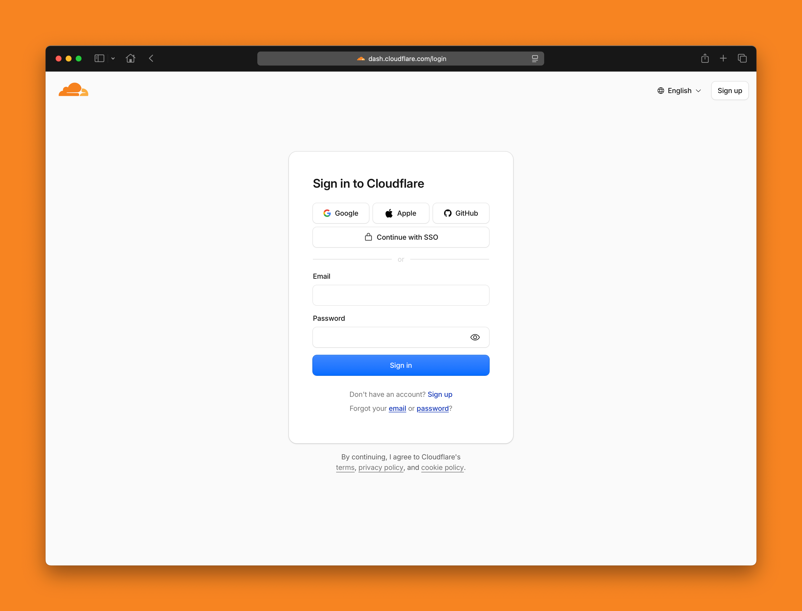

# Home

<figure><figcaption></figcaption></figure>

Your managed Cloudflare account provides additional tools to improve your website’s performance, security, and reliability.

Cloudflare sits between your website visitors and your hosting account, helping deliver content faster, protect your website from unwanted traffic, and optimize how your website is served around the world.

From your managed Cloudflare account, you can:

* Configure SSL/TLS settings for your websites
* Manage caching and browser cache behavior
* Optimize website performance using Cloudflare performance features
* Create and manage Page Rules and Cache Rules
* Configure website customizations, including redirects and URL rewrites where supported
* Manage Web Application Firewall (WAF) settings and IP Access Rules
* Configure Bot Management and Super Bot Fight Mode
* Create and manage Turnstile widgets to protect forms from spam
* Purge the Cloudflare cache after making website changes
* View website traffic, performance, security, and caching analytics

Your managed Cloudflare account is integrated with Elements Hosting, allowing you to safely manage many Cloudflare features while Elements Hosting continues to manage your DNS configuration and core account settings.

To get started, log into your managed Cloudflare account using the invitation email you received when your hosting account was created.

If you no longer have access to your managed Cloudflare account, please contact the Elements Hosting support team for assistance.

